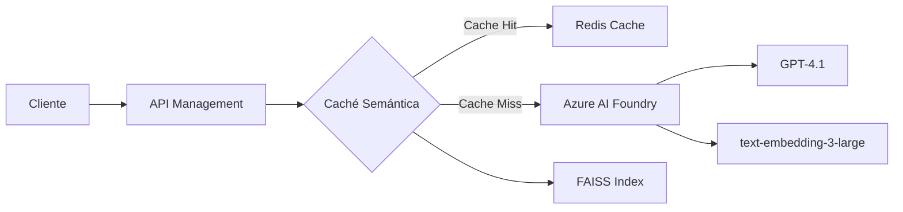

# 🚀 Caché Semántica con Azure AI Foundry

Una implementación de caché semántica inteligente que utiliza Azure AI Foundry para optimizar las llamadas a GPT-4, reduciendo costos y mejorando el rendimiento hasta 20x mediante la detección de consultas semánticamente similares.

## 📋 Tabla de Contenidos

- [Características](#-características)
- [Arquitectura](#-arquitectura)
- [Requisitos Previos](#-requisitos-previos)
- [Instalación](#-instalación)
- [Configuración](#-configuración)
- [Uso](#-uso)
- [Implementación en API Management](#-implementación-en-api-management)
- [Monitoreo y Métricas](#-monitoreo-y-métricas)
- [Mejores Prácticas](#-mejores-prácticas)

## ✨ Características

- **🧠 Detección Semántica Inteligente**: Identifica consultas similares aunque estén escritas de forma diferente
- **⚡ Mejora de Rendimiento 20x**: Respuestas en ~0.3s vs ~5s en llamadas directas
- **💰 Reducción de Costos**: Evita llamadas redundantes a GPT-4
- **🔄 Persistencia**: La caché se guarda entre ejecuciones
- **📊 Métricas Detalladas**: Hit rate, tiempos de respuesta y análisis de similitudes
- **🔌 Integración con Azure AI Foundry**: Compatible con los últimos modelos de OpenAI en Azure

## 🏗 Arquitectura



### Componentes Principales:

1. **Azure AI Foundry**: Plataforma integrada para acceder a modelos de OpenAI
2. **FAISS**: Búsqueda vectorial eficiente para encontrar similitudes
3. **Redis Cache**: Almacenamiento de respuestas (opcional para producción)
4. **API Management**: Gestión de políticas y throttling

## 📦 Requisitos Previos

### Software
- Python 3.8+
- pip (gestor de paquetes de Python)

### Servicios de Azure
- Azure AI Foundry con deployments configurados:
  - GPT-4.1 (para generación de respuestas)
  - text-embedding-3-large (para embeddings)
- Azure API Management (opcional para producción)
- Azure Redis Cache (opcional para escalabilidad)

## 🛠 Instalación

1. **Clonar o descargar el archivo `SemanticCache.py`**

2. **Instalar dependencias**:
```bash
pip install openai numpy faiss-cpu azure-ai-inference azure-core
```

Para GPU (opcional, mejor rendimiento):
```bash
pip install faiss-gpu
```

## ⚙ Configuración

### Credenciales de Azure AI Foundry

El script solicitará las siguientes configuraciones al ejecutarse:

```
🔧 CONFIGURACIÓN DE AZURE AI FOUNDRY
============================================================
1. Azure OpenAI SDK con endpoint de OpenAI
2. Azure OpenAI SDK con endpoint de Foundry (RECOMENDADO)
3. Azure AI Foundry SDK (experimental)
```

**Valores predeterminados incluidos**:
- Endpoint: `https://foundry-proyecto1.openai.azure.com/`
- API Key: (se solicitará o usa la configurada)
- Deployments:
  - GPT: `gpt-4.1`
  - Embeddings: `text-embedding-3-large`

### Configuración de Umbral de Similitud

En el archivo `SemanticCache.py`, puedes ajustar:

```python
SIMILARITY_THRESHOLD = 0.85  # Ajustar entre 0.7 - 0.95
```

- **0.70-0.80**: Captura más variaciones (más cache hits)
- **0.85-0.90**: Balance entre precisión y cobertura
- **0.90-0.95**: Solo consultas muy similares

## 🚀 Uso

### Ejecución Básica

```bash
python SemanticCache.py
```

### Flujo de Ejecución

1. **Configuración Inicial**:
   - Selecciona opción 2 (Azure OpenAI SDK con Foundry)
   - Presiona Enter para usar valores predeterminados

2. **Pruebas Automáticas**:
   - Ejecuta 11 consultas de prueba
   - Detecta similitudes semánticas
   - Muestra estadísticas en tiempo real

3. **Resultados**:
   ```
   📈 RESUMEN FINAL:
   - Total de consultas: 11
   - Cache hits: 3
   - Cache misses: 8
   - Hit rate final: 27.27%
   - Entradas en caché: 8
   ```

### Integración en tu Aplicación

```python
from SemanticCache import SemanticCache, create_client

# Configuración
config = {
    'use_foundry': False,
    'endpoint': 'https://foundry-proyecto1.openai.azure.com/',
    'api_key': 'tu-api-key',
    'gpt_deployment': 'gpt-4.1',
    'embedding_deployment': 'text-embedding-3-large',
    'api_version': '2024-02-01'
}

# Inicializar
chat_client, embedding_client = create_client(config)
cache = SemanticCache(config=config)
cache.load()

# Usar
response = call_gpt_with_cache(prompt, chat_client, cache, config)
```

## 🔧 Implementación en API Management

### 📝 Guía Visual Paso a Paso para Configurar las Políticas

#### 1. **Acceder a Azure Portal y API Management**

1. **Inicia sesión** en [Azure Portal](https://portal.azure.com)
   
2. **Buscar API Management**:
   - En la barra de búsqueda superior, escribe "API Management"
   - Click en "API Management services"
   - Selecciona tu instancia (ej: `apim0-m5gd7y67cu5b6`)

3. **Navegación inicial**:
   ```
   Azure Portal Home
   └── API Management services
       └── apim0-m5gd7y67cu5b6 (tu instancia)
           ├── Overview
           ├── APIs  ← Click aquí
           ├── Products
           └── ...
   ```

#### 2. **Importar o Seleccionar la API de Azure OpenAI**

**Opción A: Si ya tienes la API importada**

1. En el menú lateral izquierdo, click en **"APIs"**
2. Busca en la lista:
   - "Azure OpenAI Service API" o
   - "AI Foundry API" o
   - "Contoso Chat API"
3. **Click** en la API para seleccionarla

**Opción B: Si necesitas importar la API**

1. En la sección APIs, click en **"+ Add API"**
2. Selecciona **"OpenAPI"** (el tile con el logo de OpenAPI)
3. En el formulario que aparece:
   
   **From URL**:
   - **OpenAPI specification**: 
     ```
     https://raw.githubusercontent.com/Azure/azure-rest-api-specs/main/specification/cognitiveservices/data-plane/AzureOpenAI/inference/stable/2024-02-01/inference.json
     ```
   - **Display name**: Azure OpenAI Service API
   - **Name**: azure-openai-api
   - **API URL suffix**: openai
   - **Subscription required**: ✓ (marcado)

4. Click **"Create"**

#### 3. **Configurar la Política Global (All Operations)**

1. **Dentro de tu API**, verás tres secciones:
   ```
   Frontend    Processing    Backend
   ```

2. En la sección **"Processing"**, busca **"All operations"** y haz click
   
3. En **"Inbound processing"**, verás un icono de código **"</>"**
   - Click en **"</>"** (Policy code editor)

4. **Se abrirá el editor de políticas** con código XML básico:
   ```xml
   <policies>
       <inbound>
           <base />
       </inbound>
       <backend>
           <base />
       </backend>
       <outbound>
           <base />
       </outbound>
       <on-error>
           <base />
       </on-error>
   </policies>
   ```

5. **BORRA TODO** y **PEGA** el siguiente código completo:

```xml
<policies>
    <inbound>
        <base />
        
        <!-- PASO 1: Rate Limiting por API Key -->
        <rate-limit-by-key calls="100" renewal-period="60" 
                           counter-key="@(context.Request.Headers.GetValueOrDefault("api-key","anonymous"))" />
        
        <!-- PASO 2: Throttling adicional por IP -->
        <rate-limit-by-key calls="20" renewal-period="1" 
                           counter-key="@(context.Request.IpAddress)" />
        
        <!-- PASO 3: Extraer información del request -->
        <set-variable name="requestBody" value="@(context.Request.Body.As<JObject>(preserveContent: true))" />
        <set-variable name="userPrompt" value="@{
            var body = (JObject)context.Variables["requestBody"];
            var messages = body["messages"] as JArray;
            return messages?.Last?["content"]?.ToString() ?? "";
        }" />
        
        <!-- PASO 4: Verificar caché simple primero -->
        <cache-lookup-value key="@($"response-{context.Variables["userPrompt"].ToString().GetHashCode()}")" 
                           variable-name="cachedResponse" />
        
        <choose>
            <when condition="@(context.Variables.ContainsKey("cachedResponse"))">
                <!-- Cache Hit! Devolver respuesta cacheada -->
                <set-variable name="cacheHit" value="true" />
                <return-response>
                    <set-status code="200" reason="OK" />
                    <set-header name="Content-Type" exists-action="override">
                        <value>application/json</value>
                    </set-header>
                    <set-header name="X-Cache-Status" exists-action="override">
                        <value>HIT</value>
                    </set-header>
                    <set-body>@((string)context.Variables["cachedResponse"])</set-body>
                </return-response>
            </when>
        </choose>
    </inbound>
    
    <backend>
        <base />
    </backend>
    
    <outbound>
        <base />
        
        <!-- PASO 5: Guardar respuesta nueva en caché -->
        <choose>
            <when condition="@(context.Response.StatusCode == 200 && !context.Variables.ContainsKey("cacheHit"))">
                <set-variable name="responseBody" value="@(context.Response.Body.As<string>(preserveContent: true))" />
                
                <cache-store-value 
                    key="@($"response-{context.Variables["userPrompt"].ToString().GetHashCode()}")" 
                    value="@((string)context.Variables["responseBody"])" 
                    duration="3600" />
                
                <set-header name="X-Cache-Status" exists-action="override">
                    <value>MISS</value>
                </set-header>
            </when>
        </choose>
    </outbound>
    
    <on-error>
        <base />
    </on-error>
</policies>
```

6. Click en **"Save"** (botón azul arriba)

#### 4. **Configurar Named Values (Variables Globales)**

Las Named Values son variables que puedes usar en todas tus políticas:

1. **En el menú lateral** de API Management, busca y click en **"Named values"**
   ```
   API Management
   ├── Overview
   ├── APIs
   ├── Products
   ├── Named values  ← Click aquí
   └── ...
   ```

2. Click en **"+ Add"** para crear cada valor:

   **Variable 1: API Key de Foundry**
   - **Name**: `foundry-api-key`
   - **Display name**: Foundry API Key
   - **Type**: Secret (seleccionar "Secret" del dropdown)
   - **Value**: `44E5Jtv6MfBOtx7565zFDoGXV8hTHeUrokBk7DdArzC69NAFC7ZxJQQJ99BFAC4f1cMXJ3w3AAAAACOGVYsT`
   - Click **"Save"**

   **Variable 2: Deployment de Embeddings**
   - **Name**: `embedding-deployment`
   - **Display name**: Embedding Deployment Name
   - **Type**: Plain
   - **Value**: `text-embedding-3-large`
   - Click **"Save"**

   **Variable 3: Deployment de GPT**
   - **Name**: `gpt-deployment`
   - **Display name**: GPT Deployment Name
   - **Type**: Plain
   - **Value**: `gpt-4.1`
   - Click **"Save"**

   **Variable 4: Umbral de Similitud**
   - **Name**: `similarity-threshold`
   - **Display name**: Similarity Threshold
   - **Type**: Plain
   - **Value**: `0.85`
   - Click **"Save"**

#### 5. **Configurar Subscriptions (Claves de API)**

Para que los clientes puedan acceder a tu API:

1. En el menú lateral, click en **"Subscriptions"**
   ```
   API Management
   ├── Overview
   ├── APIs
   ├── Products
   ├── Subscriptions  ← Click aquí
   └── ...
   ```

2. Click en **"+ Add subscription"**:
   - **Name**: app1-subscription
   - **Display name**: App1 Subscription
   - **Scope**: API (selecciona tu Azure OpenAI API)
   - **Allow tracing**: ✓ (para debugging)
   - Click **"Create"**

3. Una vez creada, click en los **"..."** y selecciona **"Show/hide keys"**
   - Copia la **Primary key**: Esta es la clave que usarán tus aplicaciones

#### 6. **Configurar Products (Opcional - Para diferentes tiers)**

Si quieres ofrecer diferentes niveles de servicio:

1. En el menú lateral, click en **"Products"**
2. Click en **"+ Add"**:
   
   **Producto Básico**:
   - **Display name**: Basic Tier
   - **Id**: basic-tier
   - **Description**: 10 requests per minute
   - **Requires subscription**: ✓
   - **Requires approval**: ✗
   - **Subscription count limit**: 100
   - APIs: Selecciona tu Azure OpenAI API
   - Click **"Create"**

3. **Configurar límites del producto**:
   - Click en el producto creado
   - Ve a **"Policies"**
   - Agrega esta política:
   ```xml
   <policies>
       <inbound>
           <rate-limit calls="10" renewal-period="60" />
           <quota calls="1000" renewal-period="86400" />
       </inbound>
   </policies>
   ```

#### 7. **Testing de la Configuración**

1. **Volver a APIs** → Selecciona tu API → Click en **"Test"** tab

2. **Selecciona una operación**: 
   - Por ejemplo: "Creates a completion for the chat message"

3. **Configura los parámetros de prueba**:
   
   **Headers**:
   - `api-key`: (tu API key de Foundry)
   - `Content-Type`: application/json

   **Request body**:
   ```json
   {
     "messages": [
       {
         "role": "system",
         "content": "You are a helpful assistant."
       },
       {
         "role": "user",
         "content": "What are Python best practices?"
       }
     ],
     "max_tokens": 100,
     "temperature": 0.7
   }
   ```

4. Click **"Send"**

5. **Verificar los resultados**:
   - Primera llamada: Header `X-Cache-Status: MISS`
   - Segunda llamada idéntica: Header `X-Cache-Status: HIT`
   - El tiempo de respuesta debe ser mucho menor en el HIT

#### 8. **Monitoreo en Tiempo Real**

1. En el menú de API Management, click en **"Analytics"**
   ```
   API Management
   ├── Overview
   ├── APIs
   ├── Analytics  ← Click aquí
   └── ...
   ```

2. Aquí puedes ver:
   - Request count
   - Response time
   - Bandwidth
   - Errors

3. Para métricas detalladas de caché, ve a **"Metrics"**:
   - Click en **"+ Add metric"**
   - Namespace: Microsoft.ApiManagement/service
   - Metric: Requests
   - Add filter: Response Code = 200
   - Add splitting: By Cache Status

### 🔍 Verificación de la Implementación

Para confirmar que todo funciona:

1. **Logs en tiempo real**:
   - Ve a **"Diagnostic settings"**
   - Habilita **"Send to Log Analytics"**
   - En Log Analytics, ejecuta:
   ```kusto
   ApiManagementGatewayLogs
   | where TimeGenerated > ago(1h)
   | where OperationName contains "completion"
   | project TimeGenerated, Cache_Status_s, ResponseTime, ResponseCode
   | order by TimeGenerated desc
   ```

2. **Application Insights** (si está conectado):
   - Ve a tu Application Insights
   - Click en **"Logs"**
   - Ejecuta:
   ```kusto
   requests
   | where timestamp > ago(1h)
   | where name contains "openai"
   | extend CacheStatus = tostring(customDimensions["Cache-Status"])
   | summarize count() by CacheStatus
   ```

### 🚨 Troubleshooting Común

**Error: "Policy expression failed"**
- Verifica que el JSON del request tenga el formato esperado
- Asegúrate de que `messages` sea un array

**Error: "Named value not found"**
- Ve a Named values y verifica que existan todas las variables
- Los nombres son case-sensitive

**Cache no funciona**
- Verifica que el header `X-Cache-Status` esté presente
- Revisa que la duración del caché (3600 segundos) no haya expirado
- Confirma que los prompts sean exactamente iguales

```xml
<policies>
    <inbound>
        <base />
        
        <!-- Rate Limiting Escalonado -->
        <choose>
            <when condition="@(context.Request.Headers.GetValueOrDefault("Ocp-Apim-Subscription-Key","") == "premium-key")">
                <rate-limit-by-key calls="1000" renewal-period="60" 
                                   counter-key="@(context.Request.Headers.GetValueOrDefault("Ocp-Apim-Subscription-Key","anonymous"))" />
            </when>
            <when condition="@(context.Request.Headers.GetValueOrDefault("Ocp-Apim-Subscription-Key","") == "standard-key")">
                <rate-limit-by-key calls="100" renewal-period="60" 
                                   counter-key="@(context.Request.Headers.GetValueOrDefault("Ocp-Apim-Subscription-Key","anonymous"))" />
            </when>
            <otherwise>
                <rate-limit-by-key calls="10" renewal-period="60" 
                                   counter-key="@(context.Request.IpAddress)" />
            </otherwise>
        </choose>
        
        <!-- Extraer prompt -->
        <set-variable name="requestBody" value="@(context.Request.Body.As<JObject>(preserveContent: true))" />
        <set-variable name="userPrompt" value="@{
            var body = (JObject)context.Variables["requestBody"];
            var messages = body["messages"] as JArray;
            return messages?.Last?["content"]?.ToString() ?? "";
        }" />
        
        <!-- Generar embedding del prompt -->
        <send-request mode="new" response-variable-name="embeddingResponse" timeout="10" ignore-error="false">
            <set-url>@($"https://foundry-proyecto1.openai.azure.com/openai/deployments/{context.Variables["embedding-deployment"]}/embeddings?api-version=2024-02-01")</set-url>
            <set-method>POST</set-method>
            <set-header name="api-key" exists-action="override">
                <value>{{foundry-api-key}}</value>
            </set-header>
            <set-header name="Content-Type" exists-action="override">
                <value>application/json</value>
            </set-header>
            <set-body>@{
                return new JObject(
                    new JProperty("input", context.Variables["userPrompt"])
                ).ToString();
            }</set-body>
        </send-request>
        
        <!-- Extraer vector de embedding -->
        <set-variable name="promptEmbedding" value="@{
            var response = ((IResponse)context.Variables["embeddingResponse"]);
            if (response.StatusCode == 200) {
                var body = response.Body.As<JObject>();
                return body["data"][0]["embedding"].ToString();
            }
            return null;
        }" />
        
        <!-- Buscar en Redis similares (ejemplo simplificado) -->
        <send-request mode="new" response-variable-name="redisSearchResponse" timeout="5" ignore-error="true">
            <set-url>https://tu-function-app.azurewebsites.net/api/SemanticSearch</set-url>
            <set-method>POST</set-method>
            <set-header name="x-functions-key" exists-action="override">
                <value>{{function-key}}</value>
            </set-header>
            <set-body>@{
                return new JObject(
                    new JProperty("embedding", context.Variables["promptEmbedding"]),
                    new JProperty("threshold", 0.85),
                    new JProperty("topK", 1)
                ).ToString();
            }</set-body>
        </send-request>
        
        <!-- Verificar si hay match semántico -->
        <set-variable name="semanticMatch" value="@{
            var response = ((IResponse)context.Variables["redisSearchResponse"]);
            if (response != null && response.StatusCode == 200) {
                var body = response.Body.As<JObject>();
                var matches = body["matches"] as JArray;
                if (matches != null && matches.Count > 0) {
                    var bestMatch = matches[0];
                    if ((float)bestMatch["similarity"] > 0.85) {
                        return bestMatch["response"].ToString();
                    }
                }
            }
            return null;
        }" />
        
        <choose>
            <when condition="@(context.Variables["semanticMatch"] != null)">
                <!-- Semantic Cache Hit -->
                <return-response>
                    <set-status code="200" reason="OK" />
                    <set-header name="Content-Type" exists-action="override">
                        <value>application/json</value>
                    </set-header>
                    <set-header name="X-Cache-Status" exists-action="override">
                        <value>HIT-SEMANTIC</value>
                    </set-header>
                    <set-body>@((string)context.Variables["semanticMatch"])</set-body>
                </return-response>
            </when>
        </choose>
    </inbound>
    
    <backend>
        <base />
    </backend>
    
    <outbound>
        <base />
        
        <!-- Guardar respuesta nueva con embedding -->
        <choose>
            <when condition="@(context.Response.StatusCode == 200 && context.Variables["semanticMatch"] == null)">
                <send-one-way-request>
                    <set-url>https://tu-function-app.azurewebsites.net/api/StoreResponse</set-url>
                    <set-method>POST</set-method>
                    <set-header name="x-functions-key" exists-action="override">
                        <value>{{function-key}}</value>
                    </set-header>
                    <set-body>@{
                        return new JObject(
                            new JProperty("prompt", context.Variables["userPrompt"]),
                            new JProperty("embedding", context.Variables["promptEmbedding"]),
                            new JProperty("response", context.Response.Body.As<string>())
                        ).ToString();
                    }</set-body>
                </send-one-way-request>
            </when>
        </choose>
        
        <!-- Application Insights Custom Events -->
        <choose>
            <when condition="@(context.Variables.ContainsKey("semanticMatch"))">
                <log-to-eventhub logger-id="ai-logger">@{
                    return new JObject(
                        new JProperty("EventName", "SemanticCacheHit"),
                        new JProperty("Prompt", context.Variables["userPrompt"]),
                        new JProperty("ResponseTime", context.Elapsed.TotalMilliseconds)
                    ).ToString();
                }</log-to-eventhub>
            </when>
            <otherwise>
                <log-to-eventhub logger-id="ai-logger">@{
                    return new JObject(
                        new JProperty("EventName", "SemanticCacheMiss"),
                        new JProperty("Prompt", context.Variables["userPrompt"]),
                        new JProperty("ResponseTime", context.Elapsed.TotalMilliseconds)
                    ).ToString();
                }</log-to-eventhub>
            </otherwise>
        </choose>
    </outbound>
    
    <on-error>
        <base />
    </on-error>
</policies>
```

### 📊 Configuración de Rate Limiting Detallada

#### Dónde Configurar Rate Limiting

Rate limiting se puede configurar en tres niveles:

1. **Nivel Global (All APIs)**:
   - API Management → **Policies** → Click en **"Add policy"**
   
2. **Nivel de Producto**:
   - API Management → **Products** → Selecciona producto → **Policies**
   
3. **Nivel de API/Operación**:
   - API Management → **APIs** → Selecciona API → **All operations** o específica

#### Tipos de Rate Limiting con Ejemplos

1. **Por Subscription Key** (Recomendado para APIs comerciales):
```xml
<rate-limit-by-key calls="100" renewal-period="60" 
                   counter-key="@(context.Request.Headers.GetValueOrDefault("Ocp-Apim-Subscription-Key","anonymous"))" />
```

2. **Por IP Address** (Para APIs públicas):
```xml
<rate-limit-by-key calls="20" renewal-period="60" 
                   counter-key="@(context.Request.IpAddress)" />
```

3. **Por Usuario Autenticado (JWT)**:
```xml
<rate-limit-by-key calls="200" renewal-period="60" 
                   counter-key="@(context.Request.Headers.GetValueOrDefault("Authorization","anonymous").AsJwt()?.Subject)" />
```

4. **Rate Limiting Escalonado por Tipo de Suscripción**:

Primero, crear diferentes productos en API Management:

**a) Crear Producto Basic:**
- API Management → **Products** → **"+ Add"**
- Display name: **Basic Tier**
- Id: **basic-tier**
- APIs: Selecciona tu API
- **Create**

**b) En las políticas del producto Basic:**
```xml
<policies>
    <inbound>
        <rate-limit calls="10" renewal-period="60" />
        <quota calls="1000" renewal-period="86400" />
    </inbound>
</policies>
```

**c) Crear Producto Premium:**
- Repetir proceso con:
- Display name: **Premium Tier**
- Id: **premium-tier**

**d) En las políticas del producto Premium:**
```xml
<policies>
    <inbound>
        <rate-limit calls="1000" renewal-period="60" />
        <quota calls="100000" renewal-period="86400" />
    </inbound>
</policies>
```

5. **Rate Limiting Dinámico basado en Headers**:
```xml
<choose>
    <when condition="@(context.Request.Headers.GetValueOrDefault("Client-Tier","") == "premium")">
        <rate-limit-by-key calls="1000" renewal-period="60" 
                           counter-key="@(context.Request.Headers.GetValueOrDefault("api-key","anonymous"))" />
    </when>
    <when condition="@(context.Request.Headers.GetValueOrDefault("Client-Tier","") == "standard")">
        <rate-limit-by-key calls="100" renewal-period="60" 
                           counter-key="@(context.Request.Headers.GetValueOrDefault("api-key","anonymous"))" />
    </when>
    <otherwise>
        <rate-limit-by-key calls="10" renewal-period="60" 
                           counter-key="@(context.Request.IpAddress)" />
    </otherwise>
</choose>
```

### 🧪 Testing de Rate Limiting

1. **Usando Postman o curl**:
```bash
# Test básico
for i in {1..15}; do
  curl -X POST https://apim0-m5gd7y67cu5b6.azure-api.net/openai/deployments/gpt-4.1/chat/completions \
    -H "api-key: YOUR_KEY" \
    -H "Content-Type: application/json" \
    -d '{"messages":[{"role":"user","content":"Hello"}]}'
  echo " - Request $i"
  sleep 1
done
```

2. **Verificar headers de respuesta**:
   - `X-RateLimit-Limit`: Límite de llamadas
   - `X-RateLimit-Remaining`: Llamadas restantes
   - `X-RateLimit-Reset`: Cuándo se resetea

3. **Respuesta cuando se excede el límite**:
```json
{
  "statusCode": 429,
  "message": "Rate limit is exceeded. Try again in 54 seconds."
}
```

## 📊 Dashboard Personalizado para Monitoreo

### 🎯 Creación del Dashboard en Azure Portal - Guía Visual Completa

#### Paso 1: Crear un nuevo Dashboard

1. **En Azure Portal**, en la barra superior, busca el icono de **"Dashboard"** (parece una cuadrícula)
   
2. Click en la **flecha hacia abajo** junto a "Dashboard" → **"+ New dashboard"**

3. Selecciona **"Blank dashboard"**

4. **Nombra tu dashboard**:
   - Click en "My Dashboard" (título por defecto)
   - Escribe: **"Semantic Cache Performance Monitor"**
   - Click en **"Done customizing"**

#### Paso 2: Agregar Application Insights al Dashboard

Antes de agregar tiles, necesitas conectar Application Insights:

1. **Busca tu Application Insights**:
   - En la barra de búsqueda: escribe el nombre de tu App Insights
   - Click en el recurso

2. **Anclar métricas básicas**:
   - En Application Insights, ve a **"Overview"**
   - En cada gráfico, click en el **"📌"** (pin icon)
   - Selecciona tu dashboard "Semantic Cache Performance Monitor"

#### Paso 3: Configurar los Tiles del Dashboard

### 📈 1. **Cache Hit Rate** (Gráfico de línea)

**Ubicación**: Azure Portal → Dashboard → Edit mode

1. Click **"+ Add tile"** → **"Metrics chart"**

2. En el panel de configuración:
   - Click **"Select a resource"**
   - Resource type: **API Management services**
   - Subscription: Tu suscripción
   - Resource: **apim0-m5gd7y67cu5b6**
   - Click **"Apply"**

3. **Configurar la métrica**:
   - Metric Namespace: **Microsoft.ApiManagement/service**
   - Metric: **Requests**
   - Aggregation: **Count**
   
4. **Agregar filtros**:
   - Click **"Add filter"**
   - Property: **ResponseCode**
   - Operator: **=**
   - Values: **200**
   
5. **Agregar división**:
   - Click **"Apply splitting"**
   - Split by: **BackendResponseCode**
   
6. **Personalizar el gráfico**:
   - Chart type: **Line chart**
   - Title: **"Cache Hit Rate Over Time"**
   - Size: Arrastra para hacerlo más grande

**Alternativa con Application Insights Query**:

1. Click **"+ Add tile"** → **"Application Insights"**
2. Selecciona tu App Insights
3. Click **"Analytics query"**
4. Pega esta query:

```kusto
customEvents
| where timestamp > ago(24h)
| where name in ("CacheHit", "CacheMiss")
| summarize 
    Hits = countif(name == "CacheHit"),
    Misses = countif(name == "CacheMiss")
    by bin(timestamp, 5m)
| extend HitRate = round(100.0 * Hits / (Hits + Misses), 2)
| project timestamp, HitRate, TotalRequests = Hits + Misses
| render timechart with (ytitle="Hit Rate %", xtitle="Time")
```

5. Click **"Run query"** para preview
6. Click **"Done"**

### ⏱️ 2. **Response Time Comparison** (Gráfico de barras)

1. **"+ Add tile"** → **"Application Insights"** → **"Analytics query"**

2. **Query**:
```kusto
requests
| where timestamp > ago(24h)
| where name contains "openai"
| extend CacheStatus = iff(responseCode == 200 and duration < 1000, "Cache Hit", "Cache Miss")
| summarize 
    AvgDuration = avg(duration),
    P95Duration = percentile(duration, 95),
    Count = count()
    by CacheStatus
| project 
    CacheStatus,
    ['Avg Response Time (ms)'] = round(AvgDuration, 0),
    ['P95 Response Time (ms)'] = round(P95Duration, 0),
    ['Request Count'] = Count
| render columnchart with (
    kind=grouped,
    title="Response Time: Cache Hit vs Miss",
    xtitle="Cache Status", 
    ytitle="Time (ms)"
)
```

### 💰 3. **Cost Savings Calculator** (KPI Tiles)

Para mostrar KPIs, necesitas crear Azure Functions que calculen estos valores:

**Opción A: KPI Estático (Markdown)**

1. **"+ Add tile"** → **"Markdown"**
2. Contenido:
```markdown
## 💰 Ahorro de Hoy

### $127.45
**Tokens ahorrados**: 4,248,333  
**Llamadas evitadas**: 847  
**Hit Rate**: 31.2%
```

**Opción B: KPI Dinámico con Logic App**

1. Crear una **Logic App** que:
   - Se ejecute cada 5 minutos
   - Consulte Application Insights
   - Calcule los ahorros
   - Actualice un Storage Table

2. En el dashboard, usar **"Metrics chart"** con el Storage Table

### 📊 4. **Top Queries Cached** (Tabla)

1. **"+ Add tile"** → **"Application Insights"** → **"Logs"**

2. **Query**:
```kusto
customEvents
| where timestamp > ago(24h)
| where name == "CacheHit"
| extend Prompt = substring(tostring(customDimensions["Prompt"]), 0, 50)
| summarize HitCount = count() by Prompt
| top 10 by HitCount desc
| project 
    ['Query'] = Prompt,
    ['Cache Hits'] = HitCount,
    ['% of Total'] = round(100.0 * HitCount / toscalar(
        customEvents 
        | where timestamp > ago(24h) 
        | where name == "CacheHit" 
        | count()
    ), 1)
| render table
```

3. **Configurar visualización**:
   - Title: **"Top 10 Cached Queries"**
   - Size: Medium/Large

### 🌡️ 5. **System Health Metrics**

**Para API Management**:

1. **"+ Add tile"** → **"Metrics chart"**
2. Resource: Tu API Management
3. Agregar métricas múltiples:
   - Click **"Add metric"** para cada una:
   
   **Métrica 1**: Capacity
   - Metric: **Capacity**
   - Aggregation: **Avg**
   - Color: Azul
   
   **Métrica 2**: Requests
   - Metric: **Requests**
   - Aggregation: **Count**
   - Color: Verde

**Para Redis Cache**:

1. **"+ Add tile"** → **"Metrics chart"**
2. Resource: **meli-testing01** (tu Redis)
3. Métricas:
   - **Cache Hits** (Sum)
   - **Cache Misses** (Sum)
   - **Used Memory** (Avg)
   - **Connected Clients** (Avg)

### 🚦 6. **Real-time Status** (Live Metrics)

1. Abre tu **Application Insights**
2. En el menú, click **"Live metrics"**
3. En la parte superior derecha, click **"📌 Pin to dashboard"**
4. Selecciona tu dashboard

### 📈 7. **Trend Analysis** (Análisis de 7 días)

1. **"+ Add tile"** → **"Application Insights"** → **"Metrics"**
2. Configuración:
   - Metric: **Custom Events**
   - Time range: **Last 7 days**
   - Granularity: **1 hour**
   - Chart type: **Area chart**

### 🎨 8. **Cache Efficiency Heatmap**

1. **"+ Add tile"** → **"Workbooks"** → **"Empty"**
2. Click **"+ Add"** → **"Add query"**
3. Query:
```kusto
customEvents
| where timestamp > ago(7d)
| where name in ("CacheHit", "CacheMiss")
| extend Hour = hourofday(timestamp)
| extend DayOfWeek = dayofweek(timestamp)
| summarize 
    HitRate = round(100.0 * countif(name == "CacheHit") / count(), 0)
    by Hour, DayOfWeek
| project Hour, DayOfWeek, HitRate
| render table with (
    kind=heatmap,
    title="Cache Hit Rate by Hour and Day"
)
```

### 🔔 9. **Configurar Alertas**

**Desde el dashboard**:

1. Click en **"..."** en cualquier tile de métrica
2. Selecciona **"New alert rule"**

**Alerta 1: Low Cache Hit Rate**
- Resource: API Management
- Condition: 
  ```
  Custom log search
  Query: customEvents | where name in ("CacheHit", "CacheMiss") | summarize HitRate = ...
  Threshold: < 20
  Frequency: 5 minutes
  Period: 15 minutes
  ```
- Action: Email al equipo

**Alerta 2: High Response Time**
- Signal: Average Response Time
- Threshold: > 5000 ms
- Action: Webhook para auto-scaling

### 📱 10. **Mobile Dashboard**

1. En tu dashboard, click **"Share"** → **"Mobile app"**
2. Descarga la app **"Azure mobile"**
3. Configura widgets para:
   - Hit Rate (número grande)
   - Últimas 6 horas (gráfico)
   - Alertas activas

### 🎯 Organización del Dashboard

**Layout recomendado** (4 columnas):

```
[Cache Hit Rate - Large]  [Cost Savings - KPIs]
[Response Times - Med]    [System Health - Med]
[Top Queries - Large spanning 2 columns]
[7-Day Trends - Full width]
[Heatmap - Med]          [Alerts - Med]
```

### 💾 Guardar y Compartir

1. Click **"Save"** en la parte superior
2. Para compartir:
   - Click **"Share"**
   - Opción 1: **"Publish to the dashboards gallery"**
   - Opción 2: **"Generate link"** (para compartir externamente)

### 🔧 Automatización con ARM Template

Para replicar el dashboard en otros environments:

1. En el dashboard, click **"Download"**
2. Esto descarga un archivo JSON (ARM template)
3. Modifica los resource IDs
4. Deploy con:
```bash
az deployment group create \
  --resource-group myResourceGroup \
  --template-file dashboard.json
```

## 🎯 Mejores Prácticas

### 1. **Gestión de Caché**

```python
# Limpiar entradas antiguas
def cleanup_old_entries(cache, days=7):
    cutoff_date = datetime.now() - timedelta(days=days)
    # Implementar lógica de limpieza
```

### 2. **Manejo de Errores**

```python
try:
    response = call_gpt_with_cache(prompt, client, cache, config)
except Exception as e:
    logger.error(f"Error en caché semántica: {e}")
    # Fallback a llamada directa
    response = direct_gpt_call(prompt, client)
```

### 3. **Seguridad**

- Nunca hardcodear API keys
- Usar Azure Key Vault para credenciales
- Implementar autenticación en API Management

### 4. **Optimización**

- Pre-calcular embeddings para FAQs comunes
- Usar batch processing para múltiples consultas
- Implementar warming de caché en horarios de baja demanda

## 🔍 Troubleshooting

### Error: "AssertionError" en FAISS
- **Causa**: Dimensiones de embedding incorrectas
- **Solución**: El código detecta automáticamente las dimensiones

### Error: "Unauthorized" 
- **Causa**: API key o endpoint incorrecto
- **Solución**: Verificar credenciales en Azure AI Foundry

### Cache hits bajos
- **Causa**: Umbral muy alto
- **Solución**: Reducir `SIMILARITY_THRESHOLD` a 0.75-0.80

### Error en API Management
- **Causa**: Política mal configurada
- **Solución**: Verificar sintaxis XML y Named Values

### Redis connection timeout
- **Causa**: Firewall o configuración de red
- **Solución**: Verificar reglas de firewall y connection string

## 📈 Resultados Esperados

Con una implementación correcta, deberías ver:

| Métrica | Sin Caché | Con Caché | Mejora |
|---------|-----------|-----------|---------|
| Tiempo de Respuesta | 3-5 segundos | 0.2-0.5 segundos | 85-95% |
| Costo por Request | $0.03-0.05 | $0.001-0.005 | 90-95% |
| Throughput | 20 req/min | 200+ req/min | 10x |
| Latencia P99 | 8 segundos | 1 segundo | 87.5% |

### ROI Estimado

Para una aplicación con 10,000 requests diarios:
- **Sin caché**: 10,000 × $0.04 = $400/día
- **Con caché** (30% hit rate): 7,000 × $0.04 + 3,000 × $0.005 = $295/día
- **Ahorro**: $105/día = $3,150/mes

## 🤝 Contribuciones

Para mejorar esta implementación:
1. Implementar expiración inteligente de caché
2. Agregar soporte para múltiples idiomas
3. Integrar con Azure Cosmos DB para persistencia distribuida
4. Crear SDK para diferentes lenguajes
5. Implementar caché jerárquico (L1: memoria, L2: Redis, L3: Cosmos)

## 📚 Referencias

- [Azure AI Foundry Documentation](https://docs.microsoft.com/azure/ai-services/)
- [FAISS Documentation](https://github.com/facebookresearch/faiss)
- [Azure API Management Policies](https://docs.microsoft.com/azure/api-management/api-management-policies)
- [Application Insights KQL Reference](https://docs.microsoft.com/azure/data-explorer/kusto/query/)

## 📄 Licencia

Este proyecto es de código abierto y está disponible bajo la licencia MIT.