# 🚀 Caché Semántico Optimizado para Azure OpenAI

Implementación de caché semántico inteligente que reduce costos hasta un 90% y mejora el rendimiento hasta 20x mediante Azure API Management y Azure AI Foundry.

## 📋 Tabla de Contenidos

- [Arquitectura del Sistema](#-arquitectura-del-sistema)
- [Características Principales](#-características-principales)
- [Implementación desde Azure AI Foundry](#-implementación-desde-azure-ai-foundry)
- [Configuración de Políticas](#-configuración-de-políticas)
- [Scripts de Prueba y Validación](#-scripts-de-prueba-y-validación)
- [Monitoreo y Optimización](#-monitoreo-y-optimización)
- [Mejores Prácticas](#-mejores-prácticas)

## 🏗 Arquitectura del Sistema

```mermaid
graph TB
    subgraph "Cliente"
        A[Aplicación/Usuario]
        B[SDK OpenAI/HTTP Client]
    end
    
    subgraph "Azure API Management"
        C[API Gateway]
        D[Política de Caché Semántico]
        E{Router por Operación}
        F[Política Embeddings<br/>Threshold: 0.95]
        G[Política Completions<br/>Threshold: 0.10]
    end
    
    subgraph "Caché Layer"
        H[(Caché Interno APIM)]
        I[Búsqueda Semántica]
        J[Almacenamiento con TTL]
    end
    
    subgraph "Azure AI Foundry"
        K[AI Foundry Gateway]
        L[Deployment Manager]
        M[text-embedding-3-large]
        N[GPT-4]
    end
    
    subgraph "Métricas"
        O[Application Insights]
        P[Log Analytics]
        Q[Dashboards]
    end
    
    A --> B
    B --> C
    C --> D
    D --> E
    E -->|Embeddings| F
    E -->|Chat/Completions| G
    
    F --> I
    G --> I
    
    I -->|Cache Hit| H
    I -->|Cache Miss| K
    
    H -->|Return Cached| A
    
    K --> L
    L --> M
    L --> N
    
    M -->|Store Result| J
    N -->|Store Result| J
    J --> H
    
    D --> O
    O --> P
    P --> Q
    
    style C fill:#0078D4,stroke:#fff,stroke-width:2px
    style D fill:#FF6B6B,stroke:#fff,stroke-width:2px
    style H fill:#51CF66,stroke:#fff,stroke-width:2px
    style K fill:#FFA94D,stroke:#fff,stroke-width:2px
    style M fill:#845EF7,stroke:#fff,stroke-width:2px
    style N fill:#845EF7,stroke:#fff,stroke-width:2px
```



### Flujo de Datos:

1. **Cliente** envía request a API Management
2. **Política de Caché** analiza el tipo de operación
3. **Búsqueda Semántica** verifica si existe respuesta similar
4. **Cache Hit**: Retorna respuesta inmediata (<200ms)
5. **Cache Miss**: Forward a Azure AI Foundry
6. **Almacenamiento**: Guarda respuesta con TTL optimizado

## ✨ Características Principales

### 🎯 Optimizaciones por Tipo de Operación

| Operación | Score Threshold | TTL | Particionamiento | Beneficio |
|-----------|----------------|-----|------------------|-----------|
| **Embeddings** | 0.95 | 30 días | modelo, tipo, dimensiones, usuario | 95% reducción en latencia |
| **Completions** | 0.10 | 2 horas | modelo, temperatura, tokens, usuario | 85% reducción en costos |

### 💡 Ventajas Clave

- **Reducción de Costos**: Evita llamadas redundantes a modelos costosos
- **Mejora de Latencia**: Respuestas instantáneas desde caché
- **Escalabilidad**: Maneja picos de tráfico sin impactar el backend
- **Inteligencia**: Detecta consultas semánticamente similares

## 🔧 Implementación desde Azure AI Foundry

### 📝 Paso 1: Preparar Azure AI Foundry

**¿Qué hace?**: Configura tu proyecto en AI Foundry con los modelos necesarios.

1. **Accede a Azure AI Foundry Studio**
   - Ve a [https://ai.azure.com](https://ai.azure.com)
   - Inicia sesión con tu cuenta Azure

2. **Crea o selecciona un proyecto**
   ```
   AI Foundry Studio
   └── All resources
       └── + New project
           ├── Project name: "semantic-cache-project"
           ├── Hub: Selecciona o crea uno nuevo
           └── Create
   ```

3. **Despliega los modelos necesarios**
   - En el menú lateral: **Deployments** → **+ Deploy model**
   - Modelo 1: `gpt-4` (nombre: "gpt-4")
   - Modelo 2: `text-embedding-3-large` (nombre: "text-embedding-3-large")

### 📝 Paso 2: Integrar con API Management

**¿Qué hace?**: Conecta AI Foundry con API Management para aplicar las políticas de caché.

Según la [documentación oficial de Microsoft](https://learn.microsoft.com/en-us/azure/api-management/azure-ai-foundry-api), sigue estos pasos:

1. **En Azure AI Foundry Studio**:
   ```
   Tu Proyecto
   └── Management (menú lateral)
       └── API access
           └── Deploy to API Management
   ```

2. **Configura el despliegue**:
   - **API Management instance**: Selecciona tu instancia existente o crea una nueva
   - **API name**: `Azure AI Foundry API`
   - **API URL suffix**: `ai-foundry`
   - **Subscription required**: ✓ Marcado
   - **Products**: Selecciona los productos aplicables

3. **Opciones de importación**:
   - ✓ Import all Azure OpenAI endpoints
   - ✓ Configure managed identity
   - ✓ Add CORS policy

4. **Click "Deploy"**

**Beneficios de este método**:
- ✅ Importa automáticamente todas las operaciones
- ✅ Configura la autenticación correctamente
- ✅ Agrega transformaciones necesarias
- ✅ Mantiene la compatibilidad con OpenAI SDK

### 📝 Paso 3: Verificar la Importación

**¿Qué hace?**: Confirma que todas las operaciones se importaron correctamente.

1. **En Azure Portal**, navega a tu API Management:
   ```
   Azure Portal
   └── API Management services
       └── tu-instancia-apim
           └── APIs
               └── Azure AI Foundry API
   ```

2. **Verifica las operaciones**:
   Deberías ver:
   - `POST /deployments/{deployment-id}/chat/completions`
   - `POST /deployments/{deployment-id}/completions`
   - `POST /deployments/{deployment-id}/embeddings`
   - Otras operaciones de OpenAI

### 📝 Paso 4: Aplicar Política para Embeddings

**¿Qué hace?**: Configura caché semántico optimizado para operaciones de embedding con alta precisión.

1. **Selecciona la operación de embeddings**:
   ```
   Azure AI Foundry API
   └── All operations
       └── CreateEmbeddings
           └── Design view
   ```

2. **En "Inbound processing"**, click en `</>` (Policy code editor)

3. **Reemplaza con la política optimizada**:
   ```xml
   <policies>
       <inbound>
           <base />
           <!-- La política completa está en apim-policy-embeddings-only-v2.xml -->
       </inbound>
       <backend>
           <base />
       </backend>
       <outbound>
           <base />
           <!-- Almacena con TTL de 30 días para embeddings -->
       </outbound>
       <on-error>
           <base />
       </on-error>
   </policies>
   ```

4. **Click "Save"**

**Características de esta política**:
- **Score threshold: 0.95** - Solo cachea matches exactos
- **TTL: 30 días** - Los embeddings son determinísticos
- **Particionamiento**: Por input_type, dimensions, user
- **Headers informativos**: X-Cache-Status, X-Cache-TTL-Days

### 📝 Paso 5: Aplicar Política para Completions

**¿Qué hace?**: Configura caché semántico flexible para chat y completions.

1. **Selecciona la operación de chat**:
   ```
   Azure AI Foundry API
   └── All operations
       └── CreateChatCompletion
           └── Design view
   ```

2. **Aplica la política** desde `apim-policy-completions-only-v2.xml`

**Características de esta política**:
- **Score threshold: 0.10** - Permite variaciones en consultas
- **TTL: 2 horas fijo** - Balance entre frescura y eficiencia
- **Particionamiento**: Por temperatura, max_tokens, user
- **Headers de optimización**: Recomendaciones de TTL por temperatura

### 📝 Paso 6: Configurar Backend y Seguridad

**¿Qué hace?**: Asegura la conexión entre API Management y AI Foundry.

1. **En Settings de la API**:
   ```
   Web service URL: https://tu-proyecto.openai.azure.com/openai
   ```

2. **Configurar Managed Identity**:
   - API Management → Managed identities → System assigned → Status: On
   - Copia el Object ID

3. **En AI Foundry**, asigna permisos:
   - Project → Access control (IAM)
   - Add role assignment → Cognitive Services User
   - Assign to: Managed identity → Select your APIM

### 📝 Paso 7: Crear Subscription Keys

**¿Qué hace?**: Genera claves de acceso para tus aplicaciones.

1. **En API Management → Subscriptions**:
   ```
   + Add subscription
   ├── Name: production-app
   ├── Display name: Production Application
   ├── Scope: Azure AI Foundry API
   └── Create
   ```

2. **Obtén las claves**:
   - Click en "..." → Show/hide keys
   - Copia la Primary key

## 🧪 Scripts de Prueba y Validación

### 🔬 Test 1: Validación de Caché de Embeddings

**Archivo**: `test-embedding-cache.py`

**¿Qué prueba?**
1. **Exactitud del threshold (0.95)**:
   - Verifica que solo consultas idénticas generan HIT
   - Valida que consultas similares generan MISS

2. **Particionamiento correcto**:
   - Diferentes `input_type` (query/document/passage)
   - Diferentes dimensiones (1536/3072)
   - Diferentes usuarios

3. **Batch processing**:
   - Arrays de inputs
   - Validación de hash para batches

**Beneficios**:
- ✅ Confirma configuración correcta del threshold alto
- ✅ Valida el particionamiento para evitar colisiones
- ✅ Asegura persistencia de 30 días

**Ejecución**:
```bash
python test-embedding-cache.py

# Salida esperada:
▶ Test 2/10: Consulta idéntica - Debe ser HIT
Resultado:
  └─ Cache Status: HIT
  └─ Cache Score: 1.0
  └─ TTL (días): 30
  └─ Tiempo de respuesta: 0.021s
  └─ Validación: ✓ (Esperado: HIT)
```

### 🔬 Test 2: Validación de Caché de Completions

**Archivo**: `test-completions-cache.py`

**¿Qué prueba?**
1. **Flexibilidad del threshold (0.10)**:
   - Consultas similares deben generar HIT
   - "What are Python best practices?" ≈ "What are the Python best practices?"

2. **Grupos de temperatura**:
   - Determinística (0.0-0.2): Mayor reuso
   - Baja (0.2-0.5): Reuso moderado
   - Media (0.5-0.8): Reuso limitado
   - Alta (0.8+): Mínimo reuso

3. **Parámetros avanzados**:
   - frequency_penalty y presence_penalty
   - Conversaciones multi-turno
   - Funciones/herramientas

**Beneficios**:
- ✅ Maximiza hit rate con threshold bajo
- ✅ Valida agrupación inteligente por temperatura
- ✅ Asegura compatibilidad con features avanzadas

**Ejecución**:
```bash
python test-completions-cache.py

# Métricas generadas:
📊 Estadísticas Generales:
  └─ Hit Rate: 41.7%
  └─ Mejora de velocidad: 15.2x

💰 Estimación de Ahorros:
  └─ Ahorro mensual proyectado: $567.30
```

### 🔬 Interpretación de Resultados

**Headers de respuesta clave**:

```http
# Para Embeddings
X-Semantic-Cache-Status: HIT
X-Cache-TTL-Days: 30
X-Batch-Size: 5
X-Cache-Optimization-Tip: "Document embeddings cached for 30 days"

# Para Completions  
X-Semantic-Cache-Status: MISS
X-Recommended-TTL-Hours: 12
X-Temperature-Group: deterministic
X-Cache-Optimization-Tip: "Low temperature - consider longer TTL"
```

## 📊 Monitoreo y Optimización

### Dashboard Recomendado

1. **Crear dashboard en Azure Portal**:
   ```
   Portal → Dashboard → + New dashboard
   └── Semantic Cache Monitor
       ├── Hit Rate Chart (Line)
       ├── Response Time Comparison (Bar)
       ├── Cost Savings (KPI)
       └── Top Cached Queries (Table)
   ```

2. **Queries de Application Insights**:
   ```kusto
   // Hit Rate por Hora
   customMetrics
   | where name == "CacheHitRate"
   | summarize avg(value) by bin(timestamp, 1h)
   | render timechart
   ```

### Alertas Críticas

1. **Hit Rate Bajo**:
   - Condición: Hit Rate < 20%
   - Acción: Revisar threshold y particionamiento

2. **Latencia Alta**:
   - Condición: P95 > 5 segundos
   - Acción: Verificar backend y caché

## 🎯 Mejores Prácticas

### Para Embeddings

```python
# Normalizar texto para maximizar hits
text = text.lower().strip()
text = ' '.join(text.split())  # Normalizar espacios

# Especificar input_type
request = {
    "input": text,
    "input_type": "document",  # Mejora particionamiento
    "dimensions": 3072
}
```

### Para Completions

```python
# Para consultas frecuentes (FAQs)
request = {
    "messages": [...],
    "temperature": 0.1,  # Baja para consistencia
    "seed": 42,         # Reproducibilidad
    "max_tokens": 150   # Limitar variabilidad
}
```

### Monitoreo de Costos

| Métrica | Sin Caché | Con Caché | Ahorro |
|---------|-----------|-----------|---------|
| Embeddings/día | 10,000 × $0.0004 = $4 | 6,000 × $0.0004 = $2.40 | $1.60 (40%) |
| Completions/día | 1,000 × $0.03 = $30 | 700 × $0.03 = $21 | $9 (30%) |
| **Total Mensual** | **$1,020** | **$702** | **$318** |

## 🚀 Próximos Pasos

1. **Implementar Redis Cache** para escalabilidad horizontal
2. **Agregar compresión** para respuestas grandes
3. **Crear SDK cliente** con retry automático
4. **Implementar warming** de caché para consultas comunes
5. **Agregar versionado** de respuestas cacheadas

## 📚 Referencias

- [Azure AI Foundry + API Management](https://learn.microsoft.com/en-us/azure/api-management/azure-ai-foundry-api)
- [Semantic Cache Policies](https://learn.microsoft.com/azure/api-management/azure-openai-semantic-cache-lookup-policy)
- [Azure OpenAI Service](https://learn.microsoft.com/azure/ai-services/openai/)