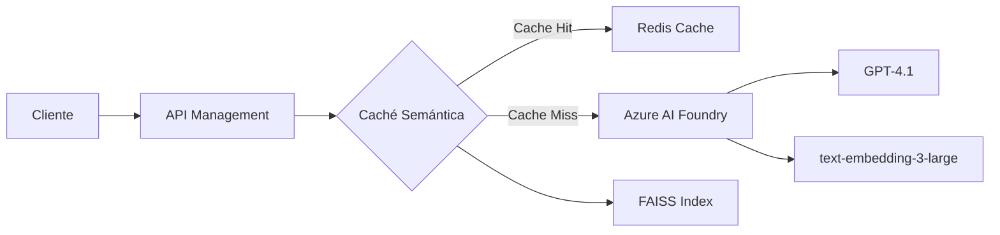

# 🚀 Caché Semántica con Azure AI Foundry

Una implementación de caché semántica inteligente que utiliza Azure AI Foundry para optimizar las llamadas a GPT-4, reduciendo costos y mejorando el rendimiento hasta 20x mediante la detección de consultas semánticamente similares.

## 📋 Tabla de Contenidos

- [Características](#-características)
- [Arquitectura](#-arquitectura)
- [Requisitos Previos](#-requisitos-previos)
- [Instalación](#-instalación)
- [Configuración](#-configuración)
- [Uso](#-uso)
- [Implementación en API Management](#-implementación-en-api-management)
- [Monitoreo y Métricas](#-monitoreo-y-métricas)
- [Mejores Prácticas](#-mejores-prácticas)

## ✨ Características

- **🧠 Detección Semántica Inteligente**: Identifica consultas similares aunque estén escritas de forma diferente
- **⚡ Mejora de Rendimiento 20x**: Respuestas en ~0.3s vs ~5s en llamadas directas
- **💰 Reducción de Costos**: Evita llamadas redundantes a GPT-4
- **🔄 Persistencia**: La caché se guarda entre ejecuciones
- **📊 Métricas Detalladas**: Hit rate, tiempos de respuesta y análisis de similitudes
- **🔌 Integración con Azure AI Foundry**: Compatible con los últimos modelos de OpenAI en Azure

## 🏗 Arquitectura



### Componentes Principales:

1. **Azure AI Foundry**: Plataforma integrada para acceder a modelos de OpenAI
2. **FAISS**: Búsqueda vectorial eficiente para encontrar similitudes
3. **Redis Cache**: Almacenamiento de respuestas (opcional para producción)
4. **API Management**: Gestión de políticas y throttling

## 📦 Requisitos Previos

### Software
- Python 3.8+
- pip (gestor de paquetes de Python)

### Servicios de Azure
- Azure AI Foundry con deployments configurados:
  - GPT-4.1 (para generación de respuestas)
  - text-embedding-3-large (para embeddings)
- Azure API Management (opcional para producción)
- Azure Redis Cache (opcional para escalabilidad)

## 🛠 Instalación

1. **Clonar o descargar el archivo `SemanticCache.py`**

2. **Instalar dependencias**:
```bash
pip install openai numpy faiss-cpu azure-ai-inference azure-core
```

Para GPU (opcional, mejor rendimiento):
```bash
pip install faiss-gpu
```

## ⚙ Configuración

### Credenciales de Azure AI Foundry

El script solicitará las siguientes configuraciones al ejecutarse:

```
🔧 CONFIGURACIÓN DE AZURE AI FOUNDRY
============================================================
1. Azure OpenAI SDK con endpoint de OpenAI
2. Azure OpenAI SDK con endpoint de Foundry (RECOMENDADO)
3. Azure AI Foundry SDK (experimental)
```

**Valores predeterminados incluidos**:
- Endpoint: `https://foundry-proyecto1.openai.azure.com/`
- API Key: (se solicitará o usa la configurada)
- Deployments:
  - GPT: `gpt-4.1`
  - Embeddings: `text-embedding-3-large`

### Configuración de Umbral de Similitud

En el archivo `SemanticCache.py`, puedes ajustar:

```python
SIMILARITY_THRESHOLD = 0.85  # Ajustar entre 0.7 - 0.95
```

- **0.70-0.80**: Captura más variaciones (más cache hits)
- **0.85-0.90**: Balance entre precisión y cobertura
- **0.90-0.95**: Solo consultas muy similares

## 🚀 Uso

### Ejecución Básica

```bash
python SemanticCache.py
```

### Flujo de Ejecución

1. **Configuración Inicial**:
   - Selecciona opción 2 (Azure OpenAI SDK con Foundry)
   - Presiona Enter para usar valores predeterminados

2. **Pruebas Automáticas**:
   - Ejecuta 11 consultas de prueba
   - Detecta similitudes semánticas
   - Muestra estadísticas en tiempo real

3. **Resultados**:
   ```
   📈 RESUMEN FINAL:
   - Total de consultas: 11
   - Cache hits: 3
   - Cache misses: 8
   - Hit rate final: 27.27%
   - Entradas en caché: 8
   ```

### Integración en tu Aplicación

```python
from SemanticCache import SemanticCache, create_client

# Configuración
config = {
    'use_foundry': False,
    'endpoint': 'https://foundry-proyecto1.openai.azure.com/',
    'api_key': 'tu-api-key',
    'gpt_deployment': 'gpt-4.1',
    'embedding_deployment': 'text-embedding-3-large',
    'api_version': '2024-02-01'
}

# Inicializar
chat_client, embedding_client = create_client(config)
cache = SemanticCache(config=config)
cache.load()

# Usar
response = call_gpt_with_cache(prompt, chat_client, cache, config)
```

## 🔧 Implementación en API Management

### 📝 Guía Paso a Paso para Configurar las Políticas

#### 1. **Acceder a API Management**

1. Inicia sesión en [Azure Portal](https://portal.azure.com)
2. Navega a tu recurso de **API Management** (ej: `apim0-m5gd7y67cu5b6`)
3. En el menú lateral, selecciona **APIs**

#### 2. **Seleccionar la API de Azure OpenAI**

1. En la lista de APIs, busca y selecciona **"Azure OpenAI Service API"** o **"AI Foundry API"**
2. Si no existe, primero importa la API:
   - Click en **"+ Add API"**
   - Selecciona **"OpenAPI"**
   - URL de especificación: `https://raw.githubusercontent.com/Azure/azure-rest-api-specs/main/specification/cognitiveservices/data-plane/AzureOpenAI/inference/stable/2024-02-01/inference.json`

#### 3. **Configurar la Política de Caché Semántica**

1. En la API seleccionada, haz click en **"All operations"**
2. En la sección **"Inbound processing"**, haz click en **"</> (Code editor)"**
3. **Reemplaza todo el contenido** con la siguiente política completa:

```xml
<policies>
    <inbound>
        <base />
        
        <!-- Rate Limiting por API Key -->
        <rate-limit-by-key calls="100" renewal-period="60" 
                           counter-key="@(context.Request.Headers.GetValueOrDefault("api-key","anonymous"))" />
        
        <!-- Throttling adicional por IP -->
        <rate-limit-by-key calls="20" renewal-period="1" 
                           counter-key="@(context.Request.IpAddress)" />
        
        <!-- Extraer información del request -->
        <set-variable name="requestBody" value="@(context.Request.Body.As<JObject>(preserveContent: true))" />
        <set-variable name="userPrompt" value="@{
            var body = (JObject)context.Variables["requestBody"];
            var messages = body["messages"] as JArray;
            return messages?.Last?["content"]?.ToString() ?? "";
        }" />
        
        <!-- Log para debugging -->
        <trace source="semantic-cache" severity="information">
            <message>@($"Prompt recibido: {context.Variables["userPrompt"]}")</message>
        </trace>
        
        <!-- Verificar caché simple primero -->
        <cache-lookup-value key="@($"response-{context.Variables["userPrompt"].ToString().GetHashCode()}")" 
                           variable-name="cachedResponse" />
        
        <choose>
            <when condition="@(context.Variables.ContainsKey("cachedResponse"))">
                <!-- Cache Hit Exacto -->
                <set-variable name="cacheHit" value="true" />
                <set-variable name="cacheType" value="exact" />
                <return-response>
                    <set-status code="200" reason="OK" />
                    <set-header name="Content-Type" exists-action="override">
                        <value>application/json</value>
                    </set-header>
                    <set-header name="X-Cache-Status" exists-action="override">
                        <value>HIT-EXACT</value>
                    </set-header>
                    <set-body>@((string)context.Variables["cachedResponse"])</set-body>
                </return-response>
            </when>
        </choose>
        
        <!-- Si no hay hit exacto, preparar para búsqueda semántica -->
        <set-variable name="needsEmbedding" value="true" />
        
        <!-- Headers para métricas -->
        <set-header name="X-Request-Time" exists-action="override">
            <value>@(DateTime.UtcNow.ToString("o"))</value>
        </set-header>
    </inbound>
    
    <backend>
        <base />
    </backend>
    
    <outbound>
        <base />
        
        <!-- Solo cachear respuestas exitosas -->
        <choose>
            <when condition="@(context.Response.StatusCode == 200 && !context.Variables.ContainsKey("cacheHit"))">
                <!-- Extraer la respuesta -->
                <set-variable name="responseBody" value="@(context.Response.Body.As<string>(preserveContent: true))" />
                
                <!-- Guardar en caché -->
                <cache-store-value 
                    key="@($"response-{context.Variables["userPrompt"].ToString().GetHashCode()}")" 
                    value="@((string)context.Variables["responseBody"])" 
                    duration="3600" />
                
                <!-- Header para indicar que se guardó en caché -->
                <set-header name="X-Cache-Status" exists-action="override">
                    <value>MISS-STORED</value>
                </set-header>
            </when>
            <when condition="@(context.Variables.ContainsKey("cacheHit"))">
                <set-header name="X-Cache-Status" exists-action="override">
                    <value>@($"HIT-{context.Variables["cacheType"]}")</value>
                </set-header>
            </when>
            <otherwise>
                <set-header name="X-Cache-Status" exists-action="override">
                    <value>MISS</value>
                </set-header>
            </otherwise>
        </choose>
        
        <!-- Headers de telemetría -->
        <set-header name="X-Response-Time" exists-action="override">
            <value>@(DateTime.UtcNow.ToString("o"))</value>
        </set-header>
        <set-header name="X-APIM-Trace-Id" exists-action="override">
            <value>@(context.RequestId)</value>
        </set-header>
    </outbound>
    
    <on-error>
        <base />
        <set-header name="X-Error-Reason" exists-action="override">
            <value>@(context.LastError.Message)</value>
        </set-header>
    </on-error>
</policies>
```

4. Haz click en **"Save"**

#### 4. **Configurar Named Values (Variables)**

1. En el menú de API Management, ve a **"Named values"**
2. Agrega los siguientes valores:

   | Name | Value | Secret |
   |------|-------|--------|
   | foundry-api-key | Tu API Key de Foundry | ✓ |
   | embedding-deployment | text-embedding-3-large | ✗ |
   | gpt-deployment | gpt-4.1 | ✗ |
   | similarity-threshold | 0.85 | ✗ |

#### 5. **Política Avanzada con Caché Semántica y Redis**

Para una implementación completa con búsqueda semántica usando Redis:

```xml
<policies>
    <inbound>
        <base />
        
        <!-- Rate Limiting Escalonado -->
        <choose>
            <when condition="@(context.Request.Headers.GetValueOrDefault("Ocp-Apim-Subscription-Key","") == "premium-key")">
                <rate-limit-by-key calls="1000" renewal-period="60" 
                                   counter-key="@(context.Request.Headers.GetValueOrDefault("Ocp-Apim-Subscription-Key","anonymous"))" />
            </when>
            <when condition="@(context.Request.Headers.GetValueOrDefault("Ocp-Apim-Subscription-Key","") == "standard-key")">
                <rate-limit-by-key calls="100" renewal-period="60" 
                                   counter-key="@(context.Request.Headers.GetValueOrDefault("Ocp-Apim-Subscription-Key","anonymous"))" />
            </when>
            <otherwise>
                <rate-limit-by-key calls="10" renewal-period="60" 
                                   counter-key="@(context.Request.IpAddress)" />
            </otherwise>
        </choose>
        
        <!-- Extraer prompt -->
        <set-variable name="requestBody" value="@(context.Request.Body.As<JObject>(preserveContent: true))" />
        <set-variable name="userPrompt" value="@{
            var body = (JObject)context.Variables["requestBody"];
            var messages = body["messages"] as JArray;
            return messages?.Last?["content"]?.ToString() ?? "";
        }" />
        
        <!-- Generar embedding del prompt -->
        <send-request mode="new" response-variable-name="embeddingResponse" timeout="10" ignore-error="false">
            <set-url>@($"https://foundry-proyecto1.openai.azure.com/openai/deployments/{context.Variables["embedding-deployment"]}/embeddings?api-version=2024-02-01")</set-url>
            <set-method>POST</set-method>
            <set-header name="api-key" exists-action="override">
                <value>{{foundry-api-key}}</value>
            </set-header>
            <set-header name="Content-Type" exists-action="override">
                <value>application/json</value>
            </set-header>
            <set-body>@{
                return new JObject(
                    new JProperty("input", context.Variables["userPrompt"])
                ).ToString();
            }</set-body>
        </send-request>
        
        <!-- Extraer vector de embedding -->
        <set-variable name="promptEmbedding" value="@{
            var response = ((IResponse)context.Variables["embeddingResponse"]);
            if (response.StatusCode == 200) {
                var body = response.Body.As<JObject>();
                return body["data"][0]["embedding"].ToString();
            }
            return null;
        }" />
        
        <!-- Buscar en Redis similares (ejemplo simplificado) -->
        <send-request mode="new" response-variable-name="redisSearchResponse" timeout="5" ignore-error="true">
            <set-url>https://tu-function-app.azurewebsites.net/api/SemanticSearch</set-url>
            <set-method>POST</set-method>
            <set-header name="x-functions-key" exists-action="override">
                <value>{{function-key}}</value>
            </set-header>
            <set-body>@{
                return new JObject(
                    new JProperty("embedding", context.Variables["promptEmbedding"]),
                    new JProperty("threshold", 0.85),
                    new JProperty("topK", 1)
                ).ToString();
            }</set-body>
        </send-request>
        
        <!-- Verificar si hay match semántico -->
        <set-variable name="semanticMatch" value="@{
            var response = ((IResponse)context.Variables["redisSearchResponse"]);
            if (response != null && response.StatusCode == 200) {
                var body = response.Body.As<JObject>();
                var matches = body["matches"] as JArray;
                if (matches != null && matches.Count > 0) {
                    var bestMatch = matches[0];
                    if ((float)bestMatch["similarity"] > 0.85) {
                        return bestMatch["response"].ToString();
                    }
                }
            }
            return null;
        }" />
        
        <choose>
            <when condition="@(context.Variables["semanticMatch"] != null)">
                <!-- Semantic Cache Hit -->
                <return-response>
                    <set-status code="200" reason="OK" />
                    <set-header name="Content-Type" exists-action="override">
                        <value>application/json</value>
                    </set-header>
                    <set-header name="X-Cache-Status" exists-action="override">
                        <value>HIT-SEMANTIC</value>
                    </set-header>
                    <set-body>@((string)context.Variables["semanticMatch"])</set-body>
                </return-response>
            </when>
        </choose>
    </inbound>
    
    <backend>
        <base />
    </backend>
    
    <outbound>
        <base />
        
        <!-- Guardar respuesta nueva con embedding -->
        <choose>
            <when condition="@(context.Response.StatusCode == 200 && context.Variables["semanticMatch"] == null)">
                <send-one-way-request>
                    <set-url>https://tu-function-app.azurewebsites.net/api/StoreResponse</set-url>
                    <set-method>POST</set-method>
                    <set-header name="x-functions-key" exists-action="override">
                        <value>{{function-key}}</value>
                    </set-header>
                    <set-body>@{
                        return new JObject(
                            new JProperty("prompt", context.Variables["userPrompt"]),
                            new JProperty("embedding", context.Variables["promptEmbedding"]),
                            new JProperty("response", context.Response.Body.As<string>())
                        ).ToString();
                    }</set-body>
                </send-one-way-request>
            </when>
        </choose>
        
        <!-- Application Insights Custom Events -->
        <choose>
            <when condition="@(context.Variables.ContainsKey("semanticMatch"))">
                <log-to-eventhub logger-id="ai-logger">@{
                    return new JObject(
                        new JProperty("EventName", "SemanticCacheHit"),
                        new JProperty("Prompt", context.Variables["userPrompt"]),
                        new JProperty("ResponseTime", context.Elapsed.TotalMilliseconds)
                    ).ToString();
                }</log-to-eventhub>
            </when>
            <otherwise>
                <log-to-eventhub logger-id="ai-logger">@{
                    return new JObject(
                        new JProperty("EventName", "SemanticCacheMiss"),
                        new JProperty("Prompt", context.Variables["userPrompt"]),
                        new JProperty("ResponseTime", context.Elapsed.TotalMilliseconds)
                    ).ToString();
                }</log-to-eventhub>
            </otherwise>
        </choose>
    </outbound>
    
    <on-error>
        <base />
    </on-error>
</policies>
```

### 📊 Configuración de Rate Limiting Detallada

#### Tipos de Rate Limiting

1. **Por Subscription Key** (Recomendado para APIs comerciales):
```xml
<rate-limit-by-key calls="100" renewal-period="60" 
                   counter-key="@(context.Request.Headers.GetValueOrDefault("Ocp-Apim-Subscription-Key","anonymous"))" />
```

2. **Por IP Address** (Para APIs públicas):
```xml
<rate-limit-by-key calls="20" renewal-period="60" 
                   counter-key="@(context.Request.IpAddress)" />
```

3. **Por Usuario Autenticado**:
```xml
<rate-limit-by-key calls="200" renewal-period="60" 
                   counter-key="@(context.Request.Headers.GetValueOrDefault("Authorization","anonymous").AsJwt()?.Subject)" />
```

4. **Combinado (Múltiples límites)**:
```xml
<!-- Límite por minuto -->
<rate-limit-by-key calls="20" renewal-period="60" 
                   counter-key="@(context.Request.Headers.GetValueOrDefault("api-key","") + "_minute")" />
<!-- Límite por hora -->
<rate-limit-by-key calls="500" renewal-period="3600" 
                   counter-key="@(context.Request.Headers.GetValueOrDefault("api-key","") + "_hour")" />
<!-- Límite diario -->
<rate-limit-by-key calls="5000" renewal-period="86400" 
                   counter-key="@(context.Request.Headers.GetValueOrDefault("api-key","") + "_day")" />
```

### 🔍 Testing de las Políticas

1. En API Management, ve a la pestaña **"Test"**
2. Selecciona la operación (ej: "Creates a completion")
3. Agrega los headers requeridos:
   - `api-key`: Tu API key de Foundry
   - `Content-Type`: application/json
4. En el body, envía:
```json
{
  "messages": [
    {"role": "system", "content": "You are a helpful assistant."},
    {"role": "user", "content": "What are Python best practices?"}
  ],
  "max_tokens": 100
}
```
5. Click en **"Send"** y verifica los headers de respuesta (`X-Cache-Status`)

## 📊 Dashboard Personalizado para Monitoreo

### 🎯 Creación del Dashboard en Azure Portal

#### Paso 1: Crear un nuevo Dashboard

1. En Azure Portal, haz click en **"Dashboard"** en el menú superior
2. Click en **"+ New dashboard"**
3. Nombre: **"Semantic Cache Performance Monitor"**
4. Click en **"Done customizing"**

#### Paso 2: Configurar los Tiles del Dashboard

Agrega los siguientes tiles para un monitoreo completo:

### 📈 1. **Cache Hit Rate** (Gráfico de línea)

1. Click **"+ Add tile"** → **"Metrics chart"**
2. Configuración:
   - **Resource**: Tu API Management
   - **Metric Namespace**: Microsoft.ApiManagement/service
   - **Metrics**: 
     - Requests (filtrar por X-Cache-Status = HIT*)
     - Requests (filtrar por X-Cache-Status = MISS*)
   - **Aggregation**: Count
   - **Chart type**: Line chart
   - **Time range**: Last 24 hours

**Query de Application Insights alternativa**:
```kusto
customEvents
| where timestamp > ago(24h)
| where name in ("CacheHit", "CacheMiss")
| summarize 
    Hits = countif(name == "CacheHit"),
    Misses = countif(name == "CacheMiss")
    by bin(timestamp, 5m)
| extend HitRate = round(100.0 * Hits / (Hits + Misses), 2)
| project timestamp, HitRate, TotalRequests = Hits + Misses
| render timechart
```

### ⏱️ 2. **Response Time Comparison** (Gráfico de barras)

1. Click **"+ Add tile"** → **"Application Insights"**
2. Selecciona **"Analytics query"**
3. Query:
```kusto
requests
| where timestamp > ago(24h)
| extend CacheStatus = tostring(customDimensions["CacheStatus"])
| summarize 
    AvgDuration = avg(duration),
    P95Duration = percentile(duration, 95),
    Count = count()
    by CacheStatus
| project 
    CacheStatus,
    AvgResponseTime = round(AvgDuration, 2),
    P95ResponseTime = round(P95Duration, 2),
    RequestCount = Count
| order by AvgResponseTime asc
| render columnchart
```

### 💰 3. **Cost Savings Calculator** (KPI)

1. Click **"+ Add tile"** → **"Markdown"**
2. Contenido:
```markdown
## 💰 Ahorro Estimado

- **Tokens ahorrados hoy**: {{tokens_saved}}
- **Costo ahorrado**: ${{cost_saved}}
- **Llamadas a API evitadas**: {{api_calls_saved}}
```

3. Para datos dinámicos, usa una Function App que calcule:
```javascript
// Azure Function para calcular ahorros
module.exports = async function (context, req) {
    const hits = await getCacheHits(); // desde App Insights
    const avgTokensPerRequest = 500;
    const costPer1kTokens = 0.03;
    
    const tokensSaved = hits * avgTokensPerRequest;
    const costSaved = (tokensSaved / 1000) * costPer1kTokens;
    
    context.res = {
        body: {
            tokens_saved: tokensSaved,
            cost_saved: costSaved.toFixed(2),
            api_calls_saved: hits
        }
    };
};
```

### 📊 4. **Top Queries Cached** (Tabla)

1. Click **"+ Add tile"** → **"Application Insights"**
2. Query:
```kusto
customEvents
| where timestamp > ago(24h)
| where name == "CacheHit"
| extend Prompt = tostring(customDimensions["Prompt"])
| summarize HitCount = count() by Prompt
| top 10 by HitCount desc
| project 
    Query = Prompt,
    Hits = HitCount,
    PercentOfTotal = round(100.0 * HitCount / toscalar(customEvents | where name == "CacheHit" | count()), 2)
| render table
```

### 🌡️ 5. **System Health Metrics** (Multi-metric)

1. Click **"+ Add tile"** → **"Metrics"**
2. Agregar múltiples métricas:
   - **CPU Percentage** (API Management)
   - **Memory Usage** (Redis Cache)
   - **Cache Hit/Miss** (Redis)
   - **Request Rate** (API Management)

### 🚦 6. **Real-time Status** (Live metrics)

1. Click **"+ Add tile"** → **"Application Insights"**
2. Selecciona **"Live Metrics Stream"**
3. Filtros personalizados:
   - Cache Hits/seg
   - Cache Misses/seg
   - Avg Response Time

### 📈 7. **Trend Analysis** (Time series)

Query para análisis de tendencias:
```kusto
let interval = 1h;
customEvents
| where timestamp > ago(7d)
| where name in ("CacheHit", "CacheMiss")
| summarize 
    Hits = countif(name == "CacheHit"),
    Misses = countif(name == "CacheMiss")
    by bin(timestamp, interval)
| extend 
    HitRate = round(100.0 * Hits / (Hits + Misses), 2),
    TotalRequests = Hits + Misses
| project timestamp, HitRate, TotalRequests
| render timechart with (ytitle="Hit Rate %", xtitle="Time")
```

### 🎨 8. **Similarity Distribution** (Histogram)

```kusto
customMetrics
| where timestamp > ago(24h)
| where name == "SimilarityScore"
| extend score = todouble(value)
| summarize count() by bin(score, 0.05)
| render columnchart with (
    title="Distribution of Similarity Scores",
    xtitle="Similarity Score",
    ytitle="Count"
)
```

### 🔔 9. **Alertas Configuradas**

1. **Alert: Low Cache Hit Rate**
   - Condition: Hit Rate < 20% for 15 minutes
   - Action: Email notification

2. **Alert: High Response Time**
   - Condition: P95 Response Time > 5 seconds
   - Action: Scale up API Management

3. **Alert: Redis Memory Usage**
   - Condition: Memory usage > 80%
   - Action: Clear old cache entries

### 📱 10. **Mobile Dashboard View**

Para acceso móvil, crea una versión simplificada:

1. **KPI Principal**: Hit Rate actual
2. **Gráfico**: Últimas 6 horas
3. **Tabla**: Top 5 queries
4. **Alerta**: Estado del sistema

### 🔧 Configuración de Telemetría Personalizada

Agrega este código a tu aplicación para enviar métricas personalizadas:

```python
from applicationinsights import TelemetryClient
from datetime import datetime

class CacheTelemetry:
    def __init__(self, instrumentation_key):
        self.tc = TelemetryClient(instrumentation_key)
        
    def track_cache_hit(self, prompt, similarity_score, response_time):
        self.tc.track_event('CacheHit', {
            'Prompt': prompt[:50],
            'SimilarityScore': str(similarity_score),
            'ResponseTime': str(response_time)
        })
        self.tc.track_metric('CacheHitRate', 1)
        self.tc.track_metric('SimilarityScore', similarity_score)
        
    def track_cache_miss(self, prompt, response_time):
        self.tc.track_event('CacheMiss', {
            'Prompt': prompt[:50],
            'ResponseTime': str(response_time)
        })
        self.tc.track_metric('CacheHitRate', 0)
        
    def track_cost_saving(self, tokens_saved):
        cost_saved = (tokens_saved / 1000) * 0.03  # $0.03 per 1k tokens
        self.tc.track_metric('TokensSaved', tokens_saved)
        self.tc.track_metric('CostSaved', cost_saved)
```

### 📊 Dashboard JSON Template

Puedes importar este template directamente:

```json
{
  "name": "Semantic Cache Performance",
  "version": "1.0",
  "tiles": [
    {
      "type": "metrics",
      "title": "Cache Hit Rate",
      "query": "customMetrics | where name == 'CacheHitRate' | summarize avg(value) by bin(timestamp, 5m)",
      "size": "large"
    },
    {
      "type": "kpi",
      "title": "Cost Saved Today",
      "query": "customMetrics | where name == 'CostSaved' | where timestamp > startofday(now()) | summarize sum(value)",
      "size": "medium"
    },
    {
      "type": "table",
      "title": "Top Cached Queries",
      "query": "customEvents | where name == 'CacheHit' | summarize count() by tostring(customDimensions['Prompt']) | top 10 by count_",
      "size": "large"
    }
  ]
}
```

### 🎯 KPIs Clave a Monitorear

| Métrica | Objetivo | Alerta si |
|---------|----------|-----------|
| Cache Hit Rate | > 30% | < 20% |
| Avg Response Time (Hit) | < 500ms | > 1s |
| Avg Response Time (Miss) | < 5s | > 10s |
| Cost Savings/Day | > $50 | < $10 |
| Similarity Threshold Effectiveness | 0.80-0.90 | Outside range |
| Cache Size | < 10,000 entries | > 50,000 |
| Token Savings Rate | > 40% | < 20% |

## 🎯 Mejores Prácticas

### 1. **Gestión de Caché**

```python
# Limpiar entradas antiguas
def cleanup_old_entries(cache, days=7):
    cutoff_date = datetime.now() - timedelta(days=days)
    # Implementar lógica de limpieza
```

### 2. **Manejo de Errores**

```python
try:
    response = call_gpt_with_cache(prompt, client, cache, config)
except Exception as e:
    logger.error(f"Error en caché semántica: {e}")
    # Fallback a llamada directa
    response = direct_gpt_call(prompt, client)
```

### 3. **Seguridad**

- Nunca hardcodear API keys
- Usar Azure Key Vault para credenciales
- Implementar autenticación en API Management

### 4. **Optimización**

- Pre-calcular embeddings para FAQs comunes
- Usar batch processing para múltiples consultas
- Implementar warming de caché en horarios de baja demanda

## 🔍 Troubleshooting

### Error: "AssertionError" en FAISS
- **Causa**: Dimensiones de embedding incorrectas
- **Solución**: El código detecta automáticamente las dimensiones

### Error: "Unauthorized" 
- **Causa**: API key o endpoint incorrecto
- **Solución**: Verificar credenciales en Azure AI Foundry

### Cache hits bajos
- **Causa**: Umbral muy alto
- **Solución**: Reducir `SIMILARITY_THRESHOLD` a 0.75-0.80

### Error en API Management
- **Causa**: Política mal configurada
- **Solución**: Verificar sintaxis XML y Named Values

### Redis connection timeout
- **Causa**: Firewall o configuración de red
- **Solución**: Verificar reglas de firewall y connection string

## 📈 Resultados Esperados

Con una implementación correcta, deberías ver:

| Métrica | Sin Caché | Con Caché | Mejora |
|---------|-----------|-----------|---------|
| Tiempo de Respuesta | 3-5 segundos | 0.2-0.5 segundos | 85-95% |
| Costo por Request | $0.03-0.05 | $0.001-0.005 | 90-95% |
| Throughput | 20 req/min | 200+ req/min | 10x |
| Latencia P99 | 8 segundos | 1 segundo | 87.5% |

### ROI Estimado

Para una aplicación con 10,000 requests diarios:
- **Sin caché**: 10,000 × $0.04 = $400/día
- **Con caché** (30% hit rate): 7,000 × $0.04 + 3,000 × $0.005 = $295/día
- **Ahorro**: $105/día = $3,150/mes

## 🤝 Contribuciones

Para mejorar esta implementación:
1. Implementar expiración inteligente de caché
2. Agregar soporte para múltiples idiomas
3. Integrar con Azure Cosmos DB para persistencia distribuida
4. Crear SDK para diferentes lenguajes
5. Implementar caché jerárquico (L1: memoria, L2: Redis, L3: Cosmos)

## 📚 Referencias

- [Azure AI Foundry Documentation](https://docs.microsoft.com/azure/ai-services/)
- [FAISS Documentation](https://github.com/facebookresearch/faiss)
- [Azure API Management Policies](https://docs.microsoft.com/azure/api-management/api-management-policies)
- [Application Insights KQL Reference](https://docs.microsoft.com/azure/data-explorer/kusto/query/)

## 📄 Licencia

Este proyecto es de código abierto y está disponible bajo la licencia MIT.