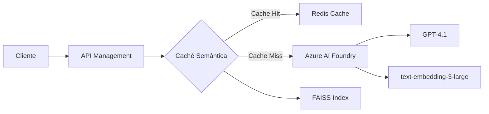

# 🚀 Caché Semántica con Azure AI Foundry

Una implementación de caché semántica inteligente que utiliza Azure AI Foundry para optimizar las llamadas a GPT-4, reduciendo costos y mejorando el rendimiento hasta 20x mediante la detección de consultas semánticamente similares.

## 📋 Tabla de Contenidos

- [Características](#-características)
- [Arquitectura](#-arquitectura)
- [Requisitos Previos](#-requisitos-previos)
- [Instalación](#-instalación)
- [Configuración](#-configuración)
- [Uso](#-uso)
- [Implementación en API Management](#-implementación-en-api-management)
- [Monitoreo y Métricas](#-monitoreo-y-métricas)
- [Mejores Prácticas](#-mejores-prácticas)

## ✨ Características

- **🧠 Detección Semántica Inteligente**: Identifica consultas similares aunque estén escritas de forma diferente
- **⚡ Mejora de Rendimiento 20x**: Respuestas en ~0.3s vs ~5s en llamadas directas
- **💰 Reducción de Costos**: Evita llamadas redundantes a GPT-4
- **🔄 Persistencia**: La caché se guarda entre ejecuciones
- **📊 Métricas Detalladas**: Hit rate, tiempos de respuesta y análisis de similitudes
- **🔌 Integración con Azure AI Foundry**: Compatible con los últimos modelos de OpenAI en Azure

## 🏗 Arquitectura



### Componentes Principales:

1. **Azure AI Foundry**: Plataforma integrada para acceder a modelos de OpenAI
2. **FAISS**: Búsqueda vectorial eficiente para encontrar similitudes
3. **Redis Cache**: Almacenamiento de respuestas (opcional para producción)
4. **API Management**: Gestión de políticas y throttling

## 📦 Requisitos Previos

### Software
- Python 3.8+
- pip (gestor de paquetes de Python)

### Servicios de Azure
- Azure AI Foundry con deployments configurados:
  - GPT-4.1 (para generación de respuestas)
  - text-embedding-3-large (para embeddings)
- Azure API Management (opcional para producción)
- Azure Redis Cache (opcional para escalabilidad)

## 🛠 Instalación

1. **Clonar o descargar el archivo `SemanticCache.py`**

2. **Instalar dependencias**:
```bash
pip install openai numpy faiss-cpu azure-ai-inference azure-core
```

Para GPU (opcional, mejor rendimiento):
```bash
pip install faiss-gpu
```

## ⚙ Configuración

### Credenciales de Azure AI Foundry

El script solicitará las siguientes configuraciones al ejecutarse:

```
🔧 CONFIGURACIÓN DE AZURE AI FOUNDRY
============================================================
1. Azure OpenAI SDK con endpoint de OpenAI
2. Azure OpenAI SDK con endpoint de Foundry (RECOMENDADO)
3. Azure AI Foundry SDK (experimental)
```

**Valores predeterminados incluidos**:
- Endpoint: `https://foundry-proyecto1.openai.azure.com/`
- API Key: (se solicitará o usa la configurada)
- Deployments:
  - GPT: `gpt-4.1`
  - Embeddings: `text-embedding-3-large`

### Configuración de Umbral de Similitud

En el archivo `SemanticCache.py`, puedes ajustar:

```python
SIMILARITY_THRESHOLD = 0.85  # Ajustar entre 0.7 - 0.95
```

- **0.70-0.80**: Captura más variaciones (más cache hits)
- **0.85-0.90**: Balance entre precisión y cobertura
- **0.90-0.95**: Solo consultas muy similares

## 🚀 Uso

### Ejecución Básica

```bash
python SemanticCache.py
```

### Flujo de Ejecución

1. **Configuración Inicial**:
   - Selecciona opción 2 (Azure OpenAI SDK con Foundry)
   - Presiona Enter para usar valores predeterminados

2. **Pruebas Automáticas**:
   - Ejecuta 11 consultas de prueba
   - Detecta similitudes semánticas
   - Muestra estadísticas en tiempo real

3. **Resultados**:
   ```
   📈 RESUMEN FINAL:
   - Total de consultas: 11
   - Cache hits: 3
   - Cache misses: 8
   - Hit rate final: 27.27%
   - Entradas en caché: 8
   ```

### Integración en tu Aplicación

```python
from SemanticCache import SemanticCache, create_client

# Configuración
config = {
    'use_foundry': False,
    'endpoint': 'https://foundry-proyecto1.openai.azure.com/',
    'api_key': 'tu-api-key',
    'gpt_deployment': 'gpt-4.1',
    'embedding_deployment': 'text-embedding-3-large',
    'api_version': '2024-02-01'
}

# Inicializar
chat_client, embedding_client = create_client(config)
cache = SemanticCache(config=config)
cache.load()

# Usar
response = call_gpt_with_cache(prompt, chat_client, cache, config)
```

## 🔧 Implementación en API Management

### Política de Caché Semántica

Crea una política personalizada en Azure API Management:

```xml
<policies>
    <inbound>
        <base />
        <!-- Extraer el prompt del body -->
        <set-variable name="userPrompt" value="@(context.Request.Body.As<JObject>()["messages"].Last["content"].ToString())" />
        
        <!-- Generar hash para caché -->
        <cache-lookup-value key="@("embedding-" + context.Variables["userPrompt"].ToString().GetHashCode())" 
                           variable-name="cachedEmbedding" />
        
        <!-- Si no hay embedding en caché, generarlo -->
        <choose>
            <when condition="@(context.Variables.ContainsKey("cachedEmbedding") == false)">
                <send-request mode="new" response-variable-name="embeddingResponse">
                    <set-url>https://foundry-proyecto1.openai.azure.com/openai/deployments/text-embedding-3-large/embeddings?api-version=2024-02-01</set-url>
                    <set-method>POST</set-method>
                    <set-header name="api-key" exists-action="override">
                        <value>{{foundry-api-key}}</value>
                    </set-header>
                    <set-body>@{
                        return new JObject(
                            new JProperty("input", context.Variables["userPrompt"])
                        ).ToString();
                    }</set-body>
                </send-request>
                
                <!-- Guardar embedding en caché -->
                <cache-store-value key="@("embedding-" + context.Variables["userPrompt"].ToString().GetHashCode())" 
                                  value="@(((IResponse)context.Variables["embeddingResponse"]).Body.As<JObject>()["data"][0]["embedding"])" 
                                  duration="3600" />
            </when>
        </choose>
        
        <!-- Buscar respuestas similares en caché -->
        <set-variable name="similarityThreshold" value="0.85" />
        <!-- Aquí implementarías la lógica de búsqueda vectorial con Redis o Cosmos DB -->
    </inbound>
    
    <backend>
        <base />
    </backend>
    
    <outbound>
        <base />
        <!-- Almacenar respuesta en caché si es nueva -->
        <choose>
            <when condition="@(context.Response.StatusCode == 200 && context.Variables.ContainsKey("cacheHit") == false)">
                <cache-store-value key="@("response-" + context.Variables["userPrompt"].ToString().GetHashCode())" 
                                  value="@(context.Response.Body.As<string>())" 
                                  duration="3600" />
            </when>
        </choose>
    </outbound>
    
    <on-error>
        <base />
    </on-error>
</policies>
```

### Configuración de Rate Limiting

```xml
<rate-limit-by-key calls="100" renewal-period="60" 
                   counter-key="@(context.Request.Headers.GetValueOrDefault("api-key","anonymous"))" />
```

## 📊 Monitoreo y Métricas

### Application Insights

Agregar telemetría personalizada:

```python
from applicationinsights import TelemetryClient

tc = TelemetryClient('your-instrumentation-key')

# En la función call_gpt_with_cache
if cached_response:
    tc.track_event('CacheHit', {'prompt': prompt[:50]})
    tc.track_metric('CacheHitRate', cache.get_stats()['hit_rate'])
else:
    tc.track_event('CacheMiss', {'prompt': prompt[:50]})
```

### Consultas KQL útiles

```kusto
// Hit Rate por hora
customEvents
| where name in ("CacheHit", "CacheMiss")
| summarize 
    Hits = countif(name == "CacheHit"),
    Misses = countif(name == "CacheMiss")
    by bin(timestamp, 1h)
| extend HitRate = round(100.0 * Hits / (Hits + Misses), 2)
| project timestamp, HitRate, TotalRequests = Hits + Misses

// Tiempos de respuesta
customMetrics
| where name == "ResponseTime"
| summarize 
    avg(value), 
    percentile(value, 95), 
    percentile(value, 99) 
    by bin(timestamp, 5m)
```

### Dashboard de Azure

1. Crear un nuevo dashboard en Azure Portal
2. Agregar tiles para:
   - Cache Hit Rate (línea temporal)
   - Tiempo de respuesta promedio
   - Total de requests (con/sin caché)
   - Ahorro estimado en tokens

## 🎯 Mejores Prácticas

### 1. **Gestión de Caché**

```python
# Limpiar entradas antiguas
def cleanup_old_entries(cache, days=7):
    cutoff_date = datetime.now() - timedelta(days=days)
    # Implementar lógica de limpieza
```

### 2. **Manejo de Errores**

```python
try:
    response = call_gpt_with_cache(prompt, client, cache, config)
except Exception as e:
    logger.error(f"Error en caché semántica: {e}")
    # Fallback a llamada directa
    response = direct_gpt_call(prompt, client)
```

### 3. **Seguridad**

- Nunca hardcodear API keys
- Usar Azure Key Vault para credenciales
- Implementar autenticación en API Management

### 4. **Optimización**

- Pre-calcular embeddings para FAQs comunes
- Usar batch processing para múltiples consultas
- Implementar warming de caché en horarios de baja demanda

## 🔍 Troubleshooting

### Error: "AssertionError" en FAISS
- **Causa**: Dimensiones de embedding incorrectas
- **Solución**: El código detecta automáticamente las dimensiones

### Error: "Unauthorized" 
- **Causa**: API key o endpoint incorrecto
- **Solución**: Verificar credenciales en Azure AI Foundry

### Cache hits bajos
- **Causa**: Umbral muy alto
- **Solución**: Reducir `SIMILARITY_THRESHOLD` a 0.75-0.80

## 📈 Resultados Esperados

- **Reducción de latencia**: 85-95% en consultas repetidas
- **Ahorro de costos**: 20-40% dependiendo del patrón de uso
- **Escalabilidad**: Soporta miles de consultas en caché

## 🤝 Contribuciones

Para mejorar esta implementación:
1. Implementar expiración inteligente de caché
2. Agregar soporte para múltiples idiomas
3. Integrar con Azure Cosmos DB para persistencia distribuida

## 📄 Licencia

Este proyecto es de código abierto y está disponible bajo la licencia MIT.