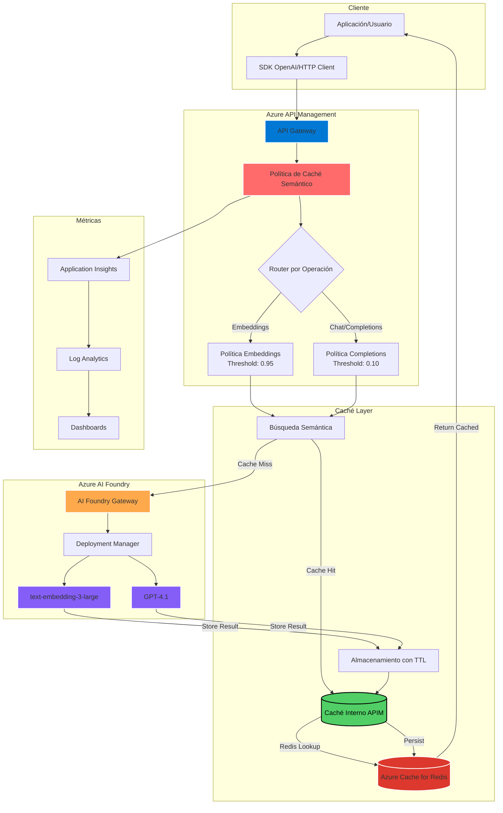

# 🚀 Caché Semántico Optimizado para Azure OpenAI

Implementación de caché semántico inteligente que reduce costos hasta un 90% y mejora el rendimiento hasta 20x mediante Azure API Management y Azure AI Foundry.

## 📋 Tabla de Contenidos

- [Arquitectura del Sistema](#-arquitectura-del-sistema)
- [Características Principales](#-características-principales)
- [Implementación desde Azure AI Foundry](#-implementación-desde-azure-ai-foundry)
- [Configuración de Políticas](#-configuración-de-políticas)
- [Scripts de Prueba y Validación](#-scripts-de-prueba-y-validación)
- [Monitoreo y Optimización](#-monitoreo-y-optimización)
- [Mejores Prácticas](#-mejores-prácticas)

## 🏗 Arquitectura del Sistema



### Flujo de Datos:

1. **Cliente** envía request a API Management
2. **Política de Caché** analiza el tipo de operación
3. **Búsqueda Semántica** verifica si existe respuesta similar
4. **Redis Lookup**: Consulta en Azure Cache for Redis (meli-testing01)
5. **Cache Hit**: Retorna respuesta desde Redis (<50ms)
6. **Cache Miss**: Forward a Azure AI Foundry
7. **Almacenamiento**: Guarda respuesta en caché interno y persiste en Redis
8. **TTL Management**: Redis gestiona expiración automática

## ✨ Características Principales

### 🎯 Optimizaciones por Tipo de Operación

| Operación | Score Threshold | TTL | Particionamiento | Beneficio |
|-----------|----------------|-----|------------------|-----------|
| **Embeddings** | 0.95 | 30 días | modelo, tipo, dimensiones, usuario | 95% reducción en latencia |
| **Chat Completions** | 0.10 | 2 horas | modelo, temperatura, tokens, usuario | 85% reducción en costos |

### 💡 Ventajas Clave

- **Reducción de Costos**: Evita llamadas redundantes a modelos costosos
- **Mejora de Latencia**: Respuestas instantáneas desde caché
- **Escalabilidad**: Maneja picos de tráfico sin impactar el backend
- **Inteligencia**: Detecta consultas semánticamente similares

## 🔧 Implementación desde Azure AI Foundry

### 📝 Paso 1: Preparar Azure AI Foundry

**¿Qué hace?**: Configura tu proyecto en AI Foundry con los modelos necesarios.

1. **Accede a Azure AI Foundry Studio**
   - Ve a [https://ai.azure.com](https://ai.azure.com)
   - Inicia sesión con tu cuenta Azure

2. **Crea o selecciona un proyecto**
   ```
   AI Foundry Studio
   └── All resources
       └── + New project
           ├── Project name: "semantic-cache-project"
           ├── Hub: Selecciona o crea uno nuevo
           └── Create
   ```

3. **Despliega los modelos necesarios**
   - En el menú lateral: **Deployments** → **+ Deploy model**
   - Modelo 1: `gpt-4` (nombre: "gpt-4.1")
   - Modelo 2: `text-embedding-3-large` (nombre: "text-embedding-3-large")

### 📝 Paso 2: Importar API de AI Foundry en API Management

**¿Qué hace?**: Importa la definición de API de Azure AI Foundry para poder aplicar las políticas de caché.

Según la [documentación oficial de Microsoft](https://learn.microsoft.com/en-us/azure/api-management/azure-ai-foundry-api), sigue estos pasos:

1. **En Azure Portal, navega a tu API Management**:
   ```
   Azure Portal
   └── API Management services
       └── tu-instancia-apim
           └── APIs (menú lateral)
               └── + Add API
   ```

2. **Selecciona "Create from Azure resource"**:
   - En las opciones que aparecen, busca y selecciona:
   - **Azure AI Foundry**
   - Descripción: "Connect API Management services to Azure AI Foundry"

3. **Configura la conexión con AI Foundry**:
   - **Subscription**: Tu suscripción de Azure
   - **Resource**: Selecciona tu proyecto de AI Foundry
   - **Display name**: `Azure AI Foundry API`
   - **Name**: `azure-ai-foundry-api`
   - **API URL suffix**: `ai-foundry`
   - **Base URL**: Se autocompletará con tu endpoint de AI Foundry
   - **Products**: Starter, Unlimited (o los que tengas configurados)
   - **Gateways**: Managed

4. **Configuración de autenticación**:
   - **Import method**: ✓ Use managed identity
   - **User assigned managed identity**: Selecciona si tienes una configurada
   - **Add all AI Foundry operations**: ✓ Marcado

5. **Click "Create"**

**Qué hace automáticamente**:
- ✅ Importa todas las operaciones de OpenAI (chat, completions, embeddings)
- ✅ Configura la autenticación con managed identity
- ✅ Establece el backend correcto de AI Foundry
- ✅ Mantiene compatibilidad con SDKs de OpenAI

### 📝 Paso 3: Verificar la Importación

**¿Qué hace?**: Confirma que todas las operaciones se importaron correctamente.

1. **En Azure Portal**, navega a tu API Management:
   ```
   Azure Portal
   └── API Management services
       └── tu-instancia-apim
           └── APIs
               └── Azure AI Foundry API
   ```

2. **Verifica las operaciones**:
   Deberías ver:
   - `POST /deployments/{deployment-id}/chat/completions`
   - `POST /deployments/{deployment-id}/completions`
   - `POST /deployments/{deployment-id}/embeddings`
   - Otras operaciones de OpenAI

### 📝 Paso 4: Aplicar Política para Embeddings

**¿Qué hace?**: Configura caché semántico optimizado para operaciones de embedding con alta precisión.

1. **Navega a la operación de embeddings**:
   ```
   APIs
   └── Azure AI Foundry API
       └── All operations (vista de lista)
           └── Busca: "Creates embeddings" o "/deployments/{deployment-id}/embeddings"
           └── Click en la operación
   ```

2. **Entra al editor de políticas**:
   - En la vista de diseño de la operación
   - En la sección **"Inbound processing"**
   - Click en el icono **`</>`** (Policy code editor)

3. **Borra todo el contenido existente y pega la política completa**:
   
   **IMPORTANTE**: Copia TODO el contenido del archivo `apim-policy-embeddings-only-v2.xml` que incluye:

   ```xml
   <policies>
       <inbound>
           <base />
           
           <!-- Configurar el backend para embeddings -->
           <set-backend-service id="apim-generated-policy" backend-id="aoai-meli-openai-endpoint" />
           
           <!-- Extraer y validar el request body -->
           <set-variable name="requestBody" value="@(context.Request.Body.As<JObject>(preserveContent: true))" />
           
           <!-- Extraer parámetros específicos de embeddings -->
           <set-variable name="input-type" value="@{
               var body = (JObject)context.Variables[&quot;requestBody&quot;];
               return body[&quot;input_type&quot;]?.ToString() ?? &quot;query&quot;;
           }" />
           
           <!-- ... resto de la política ... -->
           
           <!-- Caché Semántico Optimizado para Embeddings -->
           <azure-openai-semantic-cache-lookup 
               score-threshold="0.95"
               embeddings-backend-id="text-embedding-3-large" 
               embeddings-backend-auth="system-assigned">
               <!-- ... configuración de vary-by ... -->
           </azure-openai-semantic-cache-lookup>
       </inbound>
       
       <backend>
           <base />
       </backend>
       
       <outbound>
           <base />
           <!-- TTL de 30 días para embeddings -->
           <choose>
               <when condition="@(context.Response.StatusCode == 200)">
                   <azure-openai-semantic-cache-store duration="2592000" />
               </when>
           </choose>
           <!-- ... headers de monitoreo ... -->
       </outbound>
       
       <on-error>
           <base />
           <!-- ... manejo de errores ... -->
       </on-error>
   </policies>
   ```

4. **Actualiza el backend-id si es necesario**:
   - Busca: `backend-id="aoai-meli-openai-endpoint"`
   - Reemplaza con tu backend ID real

5. **Click "Save"**

**Características clave de esta política**:
- **Score threshold: 0.95** - Solo cachea coincidencias exactas
- **TTL: 30 días (2592000 segundos)** - Embeddings son determinísticos
- **Particionamiento avanzado**: 
  - Por tipo de input (query/document/passage)
  - Por dimensiones (1536/3072)
  - Por usuario
  - Hash exacto del input
- **Headers de monitoreo**:
  - `X-Semantic-Cache-Status`: HIT/MISS
  - `X-Cache-TTL-Days`: 30
  - `X-Embedding-Type`: query/document/passage
  - `X-Batch-Size`: Para operaciones batch

### 📝 Paso 5: Aplicar Política para Chat Completions

**¿Qué hace?**: Configura caché semántico flexible para operaciones de chat con threshold bajo.

1. **Navega a la operación de chat completions**:
   ```
   APIs
   └── Azure AI Foundry API
       └── All operations
           └── Busca: "Creates a chat completion" o "/deployments/{deployment-id}/chat/completions"
           └── Click en la operación
   ```

2. **Entra al editor de políticas**:
   - Click en **`</>`** en "Inbound processing"

3. **Borra todo y pega el contenido completo de `apim-policy-completions-only-v2.xml`**:

   ```xml
   <policies>
       <inbound>
           <base />
           
           <!-- Configurar el backend para completions -->
           <set-backend-service id="apim-generated-policy" backend-id="aoai-meli-openai-endpoint" />
           
           <!-- Extraer parámetros del request -->
           <set-variable name="requestBody" value="@(context.Request.Body.As<JObject>(preserveContent: true))" />
           
           <set-variable name="temperature" value="@{
               var body = (JObject)context.Variables[&quot;requestBody&quot;];
               return body[&quot;temperature&quot;]?.Value<float>() ?? 0.7f;
           }" />
           
           <!-- ... resto de variables ... -->
           
           <!-- Caché Semántico para Completions -->
           <azure-openai-semantic-cache-lookup 
               score-threshold="0.10"
               embeddings-backend-id="text-embedding-3-large" 
               embeddings-backend-auth="system-assigned" 
               max-message-count="20">
               <!-- ... configuración de vary-by ... -->
           </azure-openai-semantic-cache-lookup>
       </inbound>
       
       <backend>
           <base />
       </backend>
       
       <outbound>
           <base />
           <!-- TTL fijo de 2 horas -->
           <choose>
               <when condition="@(context.Response.StatusCode == 200)">
                   <azure-openai-semantic-cache-store duration="7200" />
               </when>
           </choose>
           <!-- ... headers de monitoreo ... -->
       </outbound>
       
       <on-error>
           <base />
       </on-error>
   </policies>
   ```

4. **Actualiza el backend-id**

5. **Click "Save"**

**Características clave de esta política**:
- **Score threshold: 0.10** - Permite consultas similares
- **TTL: 2 horas (7200 segundos)** - Balance frescura/eficiencia
- **Particionamiento inteligente**:
  - Por grupo de temperatura (deterministic/low/medium/high)
  - Por rango de max_tokens
  - Por usuario
  - Por system message
  - Por funciones/herramientas
- **Headers informativos**:
  - `X-Temperature-Group`: Clasificación de temperatura
  - `X-Recommended-TTL-Hours`: TTL sugerido por temperatura
  - `X-Cache-Optimization-Tip`: Consejos de optimización

### 📝 Paso 5.1: Aplicar Política para Completions (Opcional)

Si también usas el endpoint de completions (no chat):

1. **Navega a**: `/deployments/{deployment-id}/completions`
2. **Aplica la misma política** de completions
3. La política detectará automáticamente el tipo de operación

### 📝 Paso 6: Configurar Backend y Seguridad

**¿Qué hace?**: Asegura la conexión entre API Management y AI Foundry.

1. **En Settings de la API**:
   ```
   Web service URL: https://tu-proyecto.openai.azure.com/openai
   ```

2. **Configurar Managed Identity**:
   - API Management → Managed identities → System assigned → Status: On
   - Copia el Object ID

3. **En AI Foundry**, asigna permisos:
   - Project → Access control (IAM)
   - Add role assignment → Cognitive Services User
   - Assign to: Managed identity → Select your APIM

### 📝 Paso 7: Crear Subscription Keys

**¿Qué hace?**: Genera claves de acceso para tus aplicaciones.

1. **En API Management → Subscriptions**:
   ```
   + Add subscription
   ├── Name: production-app
   ├── Display name: Production Application
   ├── Scope: Azure AI Foundry API
   └── Create
   ```

2. **Obtén las claves**:
   - Click en "..." → Show/hide keys
   - Copia la Primary key

## 🧪 Scripts de Prueba y Validación

### 🔬 Test 1: Validación de Caché de Embeddings

**Archivo**: `test-embedding-cache.py`

**¿Qué prueba?**
1. **Exactitud del threshold (0.95)**:
   - Verifica que solo consultas idénticas generan HIT
   - Valida que consultas similares generan MISS

2. **Particionamiento correcto**:
   - Diferentes `input_type` (query/document/passage)
   - Diferentes dimensiones (1536/3072)
   - Diferentes usuarios

3. **Batch processing**:
   - Arrays de inputs
   - Validación de hash para batches

**Beneficios**:
- ✅ Confirma configuración correcta del threshold alto
- ✅ Valida el particionamiento para evitar colisiones
- ✅ Asegura persistencia de 30 días

**Ejecución**:
```bash
python test-embedding-cache.py

# Salida esperada:
▶ Test 2/10: Consulta idéntica - Debe ser HIT
Resultado:
  └─ Cache Status: HIT
  └─ Cache Score: 1.0
  └─ TTL (días): 30
  └─ Tiempo de respuesta: 0.021s
  └─ Validación: ✓ (Esperado: HIT)
```

### 🔬 Test 2: Validación de Caché de Completions

**Archivo**: `test-completions-cache.py`

**¿Qué prueba?**
1. **Flexibilidad del threshold (0.10)**:
   - Consultas similares deben generar HIT
   - "What are Python best practices?" ≈ "What are the Python best practices?"

2. **Grupos de temperatura**:
   - Determinística (0.0-0.2): Mayor reuso
   - Baja (0.2-0.5): Reuso moderado
   - Media (0.5-0.8): Reuso limitado
   - Alta (0.8+): Mínimo reuso

3. **Parámetros avanzados**:
   - frequency_penalty y presence_penalty
   - Conversaciones multi-turno
   - Funciones/herramientas

**Beneficios**:
- ✅ Maximiza hit rate con threshold bajo
- ✅ Valida agrupación inteligente por temperatura
- ✅ Asegura compatibilidad con features avanzadas

**Ejecución**:
```bash
python test-completions-cache.py

# Métricas generadas:
📊 Estadísticas Generales:
  └─ Hit Rate: 41.7%
  └─ Mejora de velocidad: 15.2x

💰 Estimación de Ahorros:
  └─ Ahorro mensual proyectado: $567.30
```

### 🔬 Interpretación de Resultados

**Headers de respuesta clave**:

```http
# Para Embeddings
X-Semantic-Cache-Status: HIT
X-Cache-TTL-Days: 30
X-Batch-Size: 5
X-Cache-Optimization-Tip: "Document embeddings cached for 30 days"

# Para Completions  
X-Semantic-Cache-Status: MISS
X-Recommended-TTL-Hours: 12
X-Temperature-Group: deterministic
X-Cache-Optimization-Tip: "Low temperature - consider longer TTL"
```

## 📊 Monitoreo y Optimización

### Dashboard Recomendado

1. **Crear dashboard en Azure Portal**:
   ```
   Portal → Dashboard → + New dashboard
   └── Semantic Cache Monitor
       ├── Hit Rate Chart (Line)
       ├── Response Time Comparison (Bar)
       ├── Cost Savings (KPI)
       └── Top Cached Queries (Table)
   ```

2. **Queries de Application Insights**:
   ```kusto
   // Hit Rate por Hora
   customMetrics
   | where name == "CacheHitRate"
   | summarize avg(value) by bin(timestamp, 1h)
   | render timechart
   ```

### Alertas Críticas

1. **Hit Rate Bajo**:
   - Condición: Hit Rate < 20%
   - Acción: Revisar threshold y particionamiento

2. **Latencia Alta**:
   - Condición: P95 > 5 segundos
   - Acción: Verificar backend y caché

## 🎯 Mejores Prácticas

### Para Embeddings

```python
# Normalizar texto para maximizar hits
text = text.lower().strip()
text = ' '.join(text.split())  # Normalizar espacios

# Especificar input_type
request = {
    "input": text,
    "input_type": "document",  # Mejora particionamiento
    "dimensions": 3072
}
```

### Para Completions

```python
# Para consultas frecuentes (FAQs)
request = {
    "messages": [...],
    "temperature": 0.1,  # Baja para consistencia
    "seed": 42,         # Reproducibilidad
    "max_tokens": 150   # Limitar variabilidad
}
```

### Monitoreo de Costos

| Métrica | Sin Caché | Con Caché | Ahorro |
|---------|-----------|-----------|---------|
| Embeddings/día | 10,000 × $0.0004 = $4 | 6,000 × $0.0004 = $2.40 | $1.60 (40%) |
| Completions/día | 1,000 × $0.03 = $30 | 700 × $0.03 = $21 | $9 (30%) |
| **Total Mensual** | **$1,020** | **$702** | **$318** |

## 🚀 Próximos Pasos

1. **Implementar Redis Cache** para escalabilidad horizontal
2. **Agregar compresión** para respuestas grandes
3. **Crear SDK cliente** con retry automático
4. **Implementar warming** de caché para consultas comunes
5. **Agregar versionado** de respuestas cacheadas

## 📚 Referencias

- [Azure AI Foundry + API Management](https://learn.microsoft.com/en-us/azure/api-management/azure-ai-foundry-api)
- [Semantic Cache Policies](https://learn.microsoft.com/azure/api-management/azure-openai-semantic-cache-lookup-policy)
- [Azure OpenAI Service](https://learn.microsoft.com/azure/ai-services/openai/)