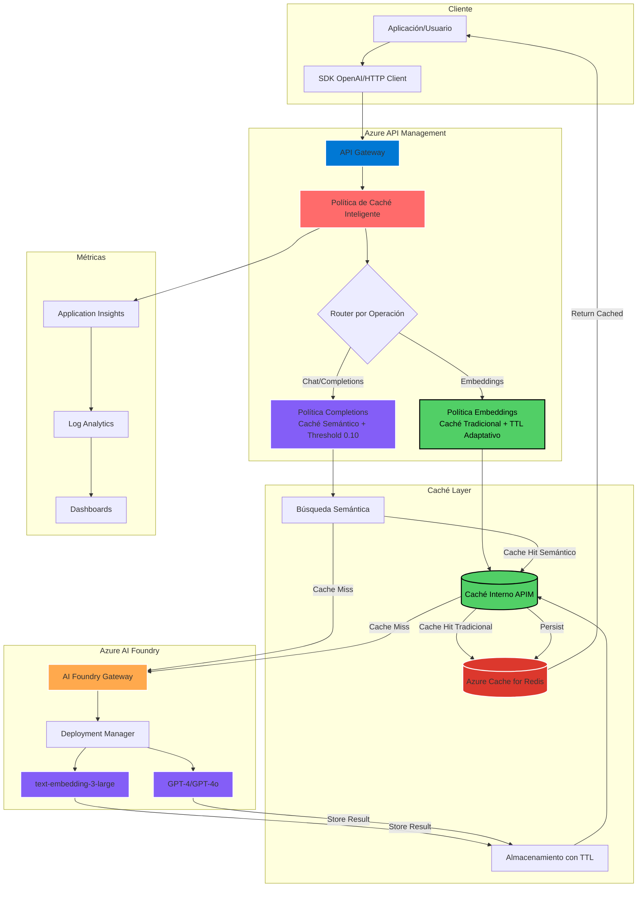

# 🚀 Implementación de Políticas de Caché para Azure OpenAI

Guía completa para implementar políticas de caché optimizadas en Azure API Management que reducen costos y mejoran el rendimiento mediante estrategias diferenciadas para cada tipo de operación.

## 📋 Tabla de Contenidos

- [Arquitectura del Sistema](#-arquitectura-del-sistema)
- [Análisis de Políticas](#-análisis-de-políticas)
- [Prerrequisitos](#-prerrequisitos)
- [Implementación Paso a Paso](#-implementación-paso-a-paso)
- [Configuración de Redis](#-configuración-de-redis)
- [Validación y Testing](#-validación-y-testing)
- [Monitoreo y Métricas](#-monitoreo-y-métricas)
- [Mejores Prácticas](#-mejores-prácticas)

## 🏗 Arquitectura del Sistema



## 🔍 Análisis de Políticas

### 📊 Comparación de Estrategias

| Característica | Política Completions | Política Embeddings |
|----------------|---------------------|-------------------|
| **Tipo de Caché** | Semántico Azure OpenAI | Tradicional optimizado |
| **Threshold** | 0.10 (flexible) | N/A (hash exacto) |
| **TTL** | Fijo 2 horas | Adaptativo 1h - 7 días |
| **Particionamiento** | 8 dimensiones | 6 dimensiones |
| **Rate Limiting** | No | Sí (dinámico) |
| **Batch Support** | Implícito | Explícito |
| **Hit Rate Esperado** | 30-60% | 80-95% |

### 🎯 Política de Completions - Caché Semántico

**Características principales**:
- **Score Threshold**: 0.10 - Permite respuestas similares
- **TTL**: 2 horas fijas
- **Agrupación por temperatura**: Optimiza hits por comportamiento
- **Particionamiento inteligente**: Evita colisiones entre contextos

**Casos de uso ideales**:
- Chatbots con consultas frecuentes similares
- APIs de Q&A con variaciones mínimas
- Sistemas con baja temperatura (respuestas consistentes)

### 🎯 Política de Embeddings - Caché Tradicional Optimizado

**Características principales**:
- **TTL Adaptativo**: 1 hora (queries) a 7 días (documentos)
- **Detección de batch**: Optimiza operaciones masivas
- **Rate limiting dinámico**: 100 calls/min (batch) vs 1000 calls/min (single)
- **Clave inteligente**: Hash de contenido + metadatos

**Casos de uso ideales**:
- Sistemas de búsqueda semántica
- Knowledge bases con documentos estables
- Procesamiento batch de embeddings

## 📋 Prerrequisitos

### 🔧 Infraestructura Requerida

1. **Azure API Management**
   - Tier: Standard, Premium, o Developer
   - Managed Identity habilitada

2. **Azure OpenAI Service o Azure AI Foundry**
   - Deployments configurados:
     - `gpt-4` o `gpt-4o` para completions
     - `text-embedding-3-large` para embeddings semánticos

3. **Azure Cache for Redis** (Recomendado)
   - Tier: Standard o Premium
   - Configuración de red compatible con APIM

4. **Application Insights** (Opcional)
   - Para monitoreo avanzado y métricas

### 🔑 Permisos Necesarios

```bash
# Roles requeridos en Azure
- API Management Service Contributor
- Cognitive Services User (en OpenAI/AI Foundry)
- Redis Cache Contributor (si se usa Redis)
```

## 🚀 Implementación Paso a Paso

### Paso 1: Configurar Infraestructura Base

#### 1.1 Crear Azure API Management

1. **Crear API Management**:
   ```bash
   az apim create \
     --name "apim0-m5gd7y67cu5b6" \
     --resource-group "rg-gpt-rag-model-standard" \
     --publisher-name "Tu Organización" \
     --publisher-email "admin@tudominio.com" \
     --sku-name "Standard"
   ```

2. **Habilitar Managed Identity**:
   ```bash
   az apim identity assign \
     --name "apim0-m5gd7y67cu5b6" \
     --resource-group "rg-gpt-rag-model-standard"
   ```

#### 1.2 Crear Azure Cache for Redis

1. **Crear Redis Enterprise**:
   ```bash
   az redis create \
     --name "redis-testing01" \
     --resource-group "rg-gpt-rag-model-standard" \
     --location "North Central US" \
     --sku-name "Standard" \
     --sku-capacity 3 \
     --enable-non-ssl-port false
   ```

2. **Obtener configuración de Redis**:
   ```bash
   # Obtener connection string
   az redis list-keys --name "redis-testing01" --resource-group "rg-gpt-rag-model-standard"
   
   # Obtener endpoint
   az redis show --name "redis-testing01" --resource-group "rg-gpt-rag-model-standard" --query "hostName"
   ```

#### 1.3 Configurar External Cache en API Management

1. **En Azure Portal → API Management → External cache**:
   ```
   Deployment + infrastructure → External cache → + Add
   ├── Cache instance: redis-testing01 (enterprise)
   ├── Cache instance location: North Central US  
   ├── Use from: North Central US (managed)
   ├── Description: redis-testing01.northcentralus.redis.azure.net
   └── Connection string: redis-testing01.northcentralus.redis.azure.net:undefined,password=RAp5170oGaKBbivfAN2mLZWpDlrgiFcVtAzCaGaKMCM=,ssl=True,abortConnect=False
   ```

2. **Verificar la conexión**:
   - El status debe aparecer como "Connected"
   - Redis debe estar disponible para las políticas de caché

### Paso 2: Importar API de Azure AI Foundry

1. **En Azure Portal → API Management → APIs**:
   ```
   + Add API → Create from Azure resource → Azure AI Foundry
   ├── Display name: AOAI [Your API Name]
   ├── Name: aoai
   ├── AI service: Selecciona tu recurso Azure AI Foundry
   ├── API URL suffix: aoai/models
   ├── Base URL: https://apim0-m5gd7y67cu5b6.azure-api.net/aoai/models
   └── Create
   ```

2. **Verificar operaciones importadas principales**:
   - `POST` - **Return the embedding vectors for given text prompts**
   - `POST` - **Gets chat completions for the provided chat messages**
   - `POST` - Generates an image based on a text or image prompt
   - `POST` - Return the embedding vectors for given images
   - `GET` - Returns information about the AI model deployed

### Paso 3: Aplicar Política de Completions

1. **Navegar a la operación**:
   ```
   APIs → AOAI → All operations → 
   "Gets chat completions for the provided chat messages" → Inbound processing
   ```

2. **Entrar al editor de políticas** (icono `</>`):

3. **Reemplazar todo el contenido con**:
   ```xml
   <policies>
       <inbound>
           <base />
           
           <!-- Extraer y validar el request body -->
           <set-variable name="requestBody" value="@(context.Request.Body.As<JObject>(preserveContent: true))" />
           
           <!-- Extraer parámetros específicos de completions -->
           <set-variable name="temperature" value="@{
               var body = (JObject)context.Variables[&quot;requestBody&quot;];
               return body[&quot;temperature&quot;]?.Value<float>()?? 0.7f;
           }" />
           
           <set-variable name="max-tokens" value="@{
               var body = (JObject)context.Variables[&quot;requestBody&quot;];
               return body[&quot;max_tokens&quot;]?.Value<int>() ?? 800;
           }" />
           
           <set-variable name="model" value="@{
               var body = (JObject)context.Variables[&quot;requestBody&quot;];
               return body[&quot;model&quot;]?.ToString() ?? &quot;gpt-4&quot;;
           }" />
           
           <!-- Determinar el grupo de temperatura -->
           <set-variable name="temperature-group" value="@{
               var temp = (float)context.Variables[&quot;temperature&quot;];
               if (temp <= 0.2) { return &quot;deterministic&quot;; }
               else if (temp <= 0.5) { return &quot;low&quot;; }
               else if (temp <= 0.8) { return &quot;medium&quot;; }
               else { return &quot;high&quot;; }
           }" />
           
           <!-- Caché Semántico Optimizado -->
           <azure-openai-semantic-cache-lookup 
               score-threshold="0.10" 
               embeddings-backend-id="text-embedding-3-large" 
               embeddings-backend-auth="system-assigned" 
               max-message-count="20" 
               ignore-system-messages="false">
               
               <!-- Particionamiento por suscripción -->
               <vary-by>@(context.Subscription?.Id ?? "public")</vary-by>
               
               <!-- Particionamiento por modelo -->
               <vary-by>@(context.Variables.GetValueOrDefault("model", "gpt-4"))</vary-by>
               
               <!-- Particionamiento por grupo de temperatura -->
               <vary-by>@(context.Variables.GetValueOrDefault("temperature-group", "medium"))</vary-by>
               
               <!-- Particionamiento por rango de tokens -->
               <vary-by>@{
                   var maxTokens = (int)context.Variables["max-tokens"];
                   if (maxTokens <= 256) { return "tokens-small"; }
                   else if (maxTokens <= 1024) { return "tokens-medium"; }
                   else if (maxTokens <= 2048) { return "tokens-large"; }
                   else { return "tokens-xlarge"; }
               }</vary-by>
           </azure-openai-semantic-cache-lookup>
           
           <!-- Headers de debugging -->
           <set-header name="X-Temperature-Group" exists-action="override">
               <value>@(context.Variables.GetValueOrDefault("temperature-group", "medium"))</value>
           </set-header>
           
           <set-header name="X-Model" exists-action="override">
               <value>@(context.Variables.GetValueOrDefault("model", "gpt-4"))</value>
           </set-header>
       </inbound>
       
       <backend>
           <base />
       </backend>
       
       <outbound>
           <base />
           
           <!-- Almacenar respuestas exitosas con TTL de 2 horas -->
           <choose>
               <when condition="@(context.Response.StatusCode == 200)">
                   <azure-openai-semantic-cache-store duration="7200" />
               </when>
           </choose>
           
           <!-- Headers de monitoreo -->
           <set-header name="X-Semantic-Cache-Status" exists-action="override">
               <value>@{
                   var status = context.Variables.GetValueOrDefault("semantic-cache-lookup-status", "none");
                   return status.ToString().ToUpper();
               }</value>
           </set-header>
           
           <set-header name="X-Semantic-Cache-Score" exists-action="override">
               <value>@{
                   var status = context.Variables.GetValueOrDefault("semantic-cache-lookup-status", "none");
                   if (status.ToString().ToLower() == "hit") {
                       var score = context.Variables.GetValueOrDefault("semantic-cache-lookup-score", "0");
                       return score.ToString();
                   }
                   return "N/A";
               }</value>
           </set-header>
           
           <set-header name="X-Cache-TTL-Hours" exists-action="override">
               <value>2</value>
           </set-header>
           
           <set-header name="X-Response-Time-Ms" exists-action="override">
               <value>@(context.Elapsed.TotalMilliseconds.ToString("F0"))</value>
           </set-header>
       </outbound>
       
       <on-error>
           <base />
           
           <set-header name="X-Error-Message" exists-action="override">
               <value>@(context.LastError?.Message ?? "Unknown error")</value>
           </set-header>
           
           <set-header name="X-Error-Model" exists-action="override">
               <value>@(context.Variables.GetValueOrDefault("model", "unknown"))</value>
           </set-header>
       </on-error>
   </policies>
   ```

4. **Guardar la política**

### Paso 4: Aplicar Política de Embeddings

1. **Navegar a la operación de embeddings**:
   ```
   APIs → AOAI → All operations → 
   "Return the embedding vectors for given text prompts" → Inbound processing
   ```

2. **Reemplazar con la política de embeddings**:
   ```xml
   <policies>
       <inbound>
           <base />
           
           <!-- Parsear el cuerpo JSON -->
           <set-variable name="requestBody" value="@(context.Request.Body.As<JObject>(preserveContent:true))" />
           
           <!-- Modelo solicitado -->
           <set-variable name="model" value="@{
               var body = (JObject)context.Variables["requestBody"];
               return (string)(body["model"] ?? "text-embedding-3-large");
           }" />
           
           <!-- Deployment real -->
           <set-variable name="deployment-id" value="@{
               var m = (string)context.Variables["model"];
               if (m == "text-embedding-3-small") { return "text-embedding-3-small"; }
               if (m == "text-embedding-3-large") { return "text-embedding-3-large"; }
               if (m == "text-embedding-ada-002") { return "text-embedding-3-large"; }
               return m;
           }" />
           
           <!-- Tipo de input -->
           <set-variable name="input-type" value="@{
               var body = (JObject)context.Variables["requestBody"];
               return (string)(body["input_type"] ?? "query");
           }" />
           
           <!-- Dimensiones -->
           <set-variable name="dimensions" value="@{
               var body = (JObject)context.Variables["requestBody"];
               var dims = (string)body["dimensions"];
               if (dims == null) {
                   dims = ((string)context.Variables["model"] == "text-embedding-3-large") ? "3072" : "1536";
               }
               return dims;
           }" />
           
           <!-- TTL adaptativo -->
           <set-variable name="cache-ttl" value="@{
               var t = (string)context.Variables["input-type"];
               if (t == "query") { return 3600; }        // 1 hora
               if (t == "document") { return 604800; }   // 7 días
               if (t == "passage") { return 259200; }    // 3 días
               return 86400;                             // 24 horas default
           }" />
           
           <!-- ¿Es batch? -->
           <set-variable name="is-batch" value="@{
               var input = ((JObject)context.Variables["requestBody"])["input"];
               return input != null && input.Type == JTokenType.Array;
           }" />
           
           <!-- Tamaño del batch -->
           <set-variable name="batch-size" value="@{
               var arr = ((JObject)context.Variables["requestBody"])["input"] as JArray;
               return arr != null ? arr.Count : 1;
           }" />
           
           <!-- Generar clave de caché -->
           <set-variable name="cache-key" value="@{
               var dep   = (string)context.Variables["deployment-id"];
               var mdl   = (string)context.Variables["model"];
               var typ   = (string)context.Variables["input-type"];
               var dim   = (string)context.Variables["dimensions"];
               var sub   = context.Subscription?.Id ?? "public";
               var body  = (JObject)context.Variables["requestBody"];
               var input = body["input"];

               string contentHash = "";
               if (input != null) {
                   if (input.Type == JTokenType.String) {
                       contentHash = "single:" + input.ToString().GetHashCode();
                   }
                   else if (input.Type == JTokenType.Array) {
                       var arr = (JArray)input;
                       var hashes = new System.Text.StringBuilder();
                       foreach (var itm in arr) {
                           hashes.Append(itm.ToString().GetHashCode()).Append('|');
                       }
                       contentHash = "batch:" + arr.Count + ":" + hashes.ToString().GetHashCode();
                   }
               }

               var meta = body["metadata"];
               var metaHash = meta != null ? ":meta:" + meta.ToString().GetHashCode() : "";

               return "emb:v2:" + dep + ":" + mdl + ":" + typ + ":" + dim + ":" + sub + ":" + contentHash + metaHash;
           }" />
           
           <!-- Establecer flag inicial de cache status -->
           <set-variable name="cache-status" value="MISS" />
           
           <!-- Búsqueda en caché -->
           <cache-lookup-value key="@((string)context.Variables["cache-key"])" variable-name="cached-response" />
           
           <!-- Si hay HIT, devolver inmediatamente -->
           <choose>
               <when condition="@(context.Variables.ContainsKey("cached-response") && context.Variables["cached-response"] != null)">
                   <set-variable name="cache-status" value="HIT" />
                   <return-response>
                       <set-status code="200" reason="OK" />
                       <set-header name="Content-Type" exists-action="override">
                           <value>application/json</value>
                       </set-header>
                       <set-header name="X-Cache-Status" exists-action="override">
                           <value>HIT</value>
                       </set-header>
                       <set-header name="X-Model-Version" exists-action="override">
                           <value>@((string)context.Variables["model"])</value>
                       </set-header>
                       <set-header name="X-Deployment-Used" exists-action="override">
                           <value>@((string)context.Variables["deployment-id"])</value>
                       </set-header>
                       <set-header name="X-Batch-Size" exists-action="override">
                           <value>@(((int)context.Variables["batch-size"]).ToString())</value>
                       </set-header>
                       <set-header name="X-Cache-Key" exists-action="override">
                           <value>@((string)context.Variables["cache-key"])</value>
                       </set-header>
                       <set-body>@((string)context.Variables["cached-response"])</set-body>
                   </return-response>
               </when>
           </choose>
           
           <!-- Rate limiting dinámico -->
           <rate-limit-by-key 
               calls="@(((bool)context.Variables["is-batch"]) ? 100 : 1000)" 
               renewal-period="60" 
               counter-key="@(context.Subscription?.Id ?? context.Request.IpAddress)" />
           
           <!-- Identificador de solicitud -->
           <set-header name="X-Request-ID" exists-action="override">
               <value>@(Guid.NewGuid().ToString())</value>
           </set-header>
       </inbound>
       
       <backend>
           <retry count="3" interval="2" max-interval="10" delta="2" condition="@(context.Response.StatusCode >= 500)">
               <forward-request buffer-request-body="true" timeout="30" />
           </retry>
       </backend>
       
       <outbound>
           <base />
           
           <!-- Almacenar solo respuestas 200 -->
           <choose>
               <when condition="@(context.Response.StatusCode == 200)">
                   <set-variable name="response-body" value="@(context.Response.Body.As<string>(preserveContent:true))" />
                   <cache-store-value 
                       key="@((string)context.Variables["cache-key"])" 
                       value="@((string)context.Variables["response-body"])" 
                       duration="@((int)context.Variables["cache-ttl"])" />
               </when>
           </choose>
           
           <!-- Headers de diagnóstico -->
           <set-header name="X-Cache-Status" exists-action="override">
               <value>@((string)context.Variables["cache-status"])</value>
           </set-header>
           
           <set-header name="X-Model-Version" exists-action="override">
               <value>@((string)context.Variables["model"])</value>
           </set-header>
           
           <set-header name="X-Deployment-Used" exists-action="override">
               <value>@((string)context.Variables["deployment-id"])</value>
           </set-header>
           
           <set-header name="X-Batch-Size" exists-action="override">
               <value>@(((int)context.Variables["batch-size"]).ToString())</value>
           </set-header>
           
           <set-header name="X-Processing-Time-Ms" exists-action="override">
               <value>@(((int)context.Elapsed.TotalMilliseconds).ToString())</value>
           </set-header>
           
           <set-header name="X-Cache-Key" exists-action="override">
               <value>@((string)context.Variables["cache-key"])</value>
           </set-header>
           
           <set-header name="X-Cache-TTL" exists-action="override">
               <value>@(((int)context.Variables["cache-ttl"]).ToString())</value>
           </set-header>
       </outbound>
       
       <on-error>
           <base />
           
           <return-response>
               <set-status code="@(context.Response?.StatusCode ?? 500)" reason="@(context.Response?.StatusReason ?? "Internal Server Error")" />
               <set-header name="Content-Type" exists-action="override">
                   <value>application/json</value>
               </set-header>
               <set-body>@{
                   var err = new JObject(
                       new JProperty("error", new JObject(
                           new JProperty("code",    context.LastError?.Source  ?? "EMBEDDING_ERROR"),
                           new JProperty("message", context.LastError?.Message ?? "An unexpected error occurred"),
                           new JProperty("details", new JObject(
                               new JProperty("requestId", context.RequestId),
                               new JProperty("timestamp", DateTime.UtcNow.ToString("o"))
                           ))
                       ))
                   );
                   return err.ToString();
               }</set-body>
           </return-response>
       </on-error>
   </policies>
   ```

3. **Guardar la política**

## ⚙️ Configuración Avanzada de Redis

### Optimización de Performance

Una vez configurado el External Cache, puedes optimizar la configuración de Redis:

1. **Configurar TTL por defecto en Redis**:
   ```bash
   # Conectarse a Redis CLI
   redis-cli -h redis-testing01.northcentralus.redis.azure.net -p 6380 -a RAp5170oGaKBbivfAN2mLZWpDlrgiFcVtAzCaGaKMCM --tls
   
   # Configurar TTL por defecto
   CONFIG SET timeout 7200  # 2 horas por defecto
   ```

2. **Configurar Named Values adicionales** (Opcional):
   ```
   API Management → Named values → + Add
   ├── Name: redis-default-ttl
   ├── Value: 7200
   ├── Secret: No
   └── Save
   ```

3. **Monitoreo de Redis**:
   - Habilitar métricas en Azure Portal
   - Configurar alertas para memoria y conexiones
   - Revisar logs de conexión regularmente

## 🧪 Validación y Testing

### Test de Política de Completions

```python
import requests
import time

# Configuración
apim_endpoint = "https://apim0-m5gd7y67cu5b6.azure-api.net/aoai/models"
subscription_key = "tu-subscription-key"

headers = {
    "Ocp-Apim-Subscription-Key": subscription_key,
    "Content-Type": "application/json"
}

# Test 1: Consulta inicial (debe ser MISS)
payload1 = {
    "model": "gpt-4",
    "messages": [{"role": "user", "content": "What are Python best practices?"}],
    "temperature": 0.1,
    "max_tokens": 150
}

response1 = requests.post(f"{apim_endpoint}/chat/completions", 
                         json=payload1, headers=headers)

print(f"Test 1 - Cache Status: {response1.headers.get('X-Semantic-Cache-Status')}")
print(f"Temperature Group: {response1.headers.get('X-Temperature-Group')}")
print(f"Model: {response1.headers.get('X-Model')}")

# Test 2: Consulta similar (debe ser HIT con threshold 0.10)
payload2 = {
    "model": "gpt-4", 
    "messages": [{"role": "user", "content": "What are the Python best practices?"}],
    "temperature": 0.1,
    "max_tokens": 150
}

time.sleep(1)  # Esperar propagación de caché

response2 = requests.post(f"{apim_endpoint}/chat/completions", 
                         json=payload2, headers=headers)

print(f"Test 2 - Cache Status: {response2.headers.get('X-Semantic-Cache-Status')}")
print(f"Cache Score: {response2.headers.get('X-Semantic-Cache-Score')}")
print(f"Response Time: {response2.headers.get('X-Response-Time-Ms')}ms")
```

### Test de Política de Embeddings

```python
# Test 1: Embedding inicial (debe ser MISS)
payload1 = {
    "model": "text-embedding-3-large",
    "input": "Azure API Management best practices",
    "input_type": "document",
    "dimensions": 3072
}

response1 = requests.post(f"{apim_endpoint}/embeddings", 
                         json=payload1, headers=headers)

print(f"Test 1 - Cache Status: {response1.headers.get('X-Cache-Status')}")
print(f"Model Version: {response1.headers.get('X-Model-Version')}")
print(f"Deployment Used: {response1.headers.get('X-Deployment-Used')}")
print(f"Cache TTL: {response1.headers.get('X-Cache-TTL')} seconds")
print(f"Processing Time: {response1.headers.get('X-Processing-Time-Ms')}ms")

# Test 2: Embedding idéntico (debe ser HIT)
time.sleep(1)

response2 = requests.post(f"{apim_endpoint}/embeddings", 
                         json=payload1, headers=headers)

print(f"Test 2 - Cache Status: {response2.headers.get('X-Cache-Status')}")
print(f"Cache Key: {response2.headers.get('X-Cache-Key')}")

# Test 3: Batch embedding (validar rate limiting)
payload3 = {
    "model": "text-embedding-3-large",
    "input": [
        "Azure API Management",
        "Semantic caching strategies", 
        "OpenAI embeddings optimization"
    ],
    "input_type": "query",
    "dimensions": 1536
}

response3 = requests.post(f"{apim_endpoint}/embeddings", 
                         json=payload3, headers=headers)

print(f"Test 3 - Batch Size: {response3.headers.get('X-Batch-Size')}")
print(f"Cache Status: {response3.headers.get('X-Cache-Status')}")
```

## 📊 Monitoreo y Métricas

### Dashboard de Application Insights

```kusto
// Hit Rate por Hora - Completions
customMetrics
| where name == "SemanticCacheHitRate"
| where customDimensions.operation == "completions"
| summarize avg(value) by bin(timestamp, 1h)
| render timechart

// TTL Efectivo - Embeddings  
customMetrics
| where name == "CacheTTL"
| where customDimensions.operation == "embeddings"
| summarize avg(value) by tostring(customDimensions.input_type)
| render barchart

// Ahorro de Costos Estimado
let tokenCost = 0.03; // Por 1K tokens
customMetrics
| where name == "TokensSaved"
| summarize totalSaved = sum(value)
| extend costSaved = totalSaved * tokenCost / 1000
| project CostSaved = costSaved
```

### Alertas Recomendadas

1. **Hit Rate Bajo**:
   ```kusto
   customMetrics
   | where name == "CacheHitRate"
   | summarize avg(value) by bin(timestamp, 5m)
   | where avg_value < 0.2
   ```

2. **Latencia Alta**:
   ```kusto
   customMetrics
   | where name == "ResponseTime"
   | where value > 5000
   ```

## 🎯 Mejores Prácticas

### Para Completions

1. **Optimizar temperatura**:
   ```python
   # Para FAQs y consultas repetitivas
   payload = {
       "temperature": 0.1,  # Grupo "deterministic"
       "seed": 42,          # Mayor reproducibilidad
       "max_tokens": 150    # Limitar variabilidad
   }
   ```

2. **Estructurar system messages**:
   ```python
   # System message consistente mejora hit rate
   system_msg = "You are a helpful assistant that provides concise answers."
   ```

### Para Embeddings

1. **Especificar input_type**:
   ```python
   # Para documentos estables (TTL 7 días)
   payload = {
       "input": document_text,
       "input_type": "document",
       "dimensions": 3072
   }
   
   # Para queries (TTL 1 hora)
   payload = {
       "input": search_query,
       "input_type": "query", 
       "dimensions": 1536
   }
   ```

2. **Normalizar texto**:
   ```python
   def normalize_text(text):
       return ' '.join(text.lower().strip().split())
   ```

### Estimación de Ahorros

| Métrica | Sin Caché | Con Caché | Ahorro |
|---------|-----------|-----------|---------|
| **Completions/día** | 1,000 × $0.03 = $30 | 700 × $0.03 = $21 | $9 (30%) |
| **Embeddings/día** | 10,000 × $0.0004 = $4 | 2,000 × $0.0004 = $0.80 | $3.20 (80%) |
| **Total Mensual** | $1,020 | $654 | **$366 (36%)** |
| **Latencia P95** | 2,000ms | 250ms | **87% mejora** |

## 🔧 Troubleshooting

### Problemas Comunes

1. **Hit Rate Bajo en Completions**:
   - Verificar threshold (0.10 recomendado)
   - Revisar particionamiento por temperatura
   - Validar consistencia en system messages

2. **Embeddings no se cachean**:
   - Verificar generación de cache-key
   - Confirmar TTL por input_type
   - Revisar normalización de texto

3. **Rate Limiting**:
   - Ajustar límites por tipo de operación
   - Implementar retry con backoff exponencial

### Logs Útiles

```kusto
// Errores de caché
requests
| where url contains "openai"
| where resultCode >= 400
| project timestamp, url, resultCode, customDimensions
| order by timestamp desc
```

## 🚀 Próximos Pasos

1. **Implementar caché distribuido** con Redis para alta disponibilidad
2. **Agregar compresión** para respuestas grandes  
3. **Crear SDK cliente** con retry automático y circuit breaker
4. **Implementar cache warming** para consultas frecuentes
5. **Agregar A/B testing** para optimizar thresholds

## 📚 Referencias

- [Azure API Management Policies](https://docs.microsoft.com/azure/api-management/api-management-policies)
- [Azure OpenAI Semantic Cache](https://docs.microsoft.com/azure/api-management/azure-openai-semantic-cache-lookup-policy)
- [Azure Cache for Redis](https://docs.microsoft.com/azure/azure-cache-for-redis/)